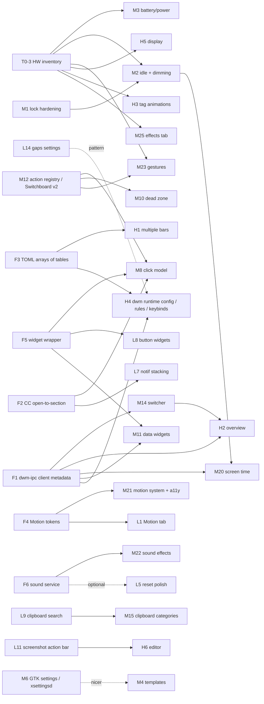

# Xidou Shell — Feature Backlog Roadmap

Working roadmap for はる and future Claude Code sessions. Planning only: nothing in this
document has been implemented as part of writing it.

- **Written:** 2026-09-27, against `master` at `32b5354`; **re-verified** the same day
  against `a941b03` (the bar overhaul commit — see 1.1).
- **Updated:** 2026-09-30, against `master` at `808c76a`. This covered the lock screen
  (1.2, #9, M1), the new panel work (section 2, "Shipped outside the backlog") and H3's
  status.
- **Updated:** 2026-10-01, against `master` at `21455fd`: はる's D1–D25 decisions
  (section 4, new D26), the sound map (section 7, M22, F6), the Settings > System layout
  (M22, L3, L16), the XidouWM rename plan (H8) and the gesture plan (M23).
- **Source:** はる's backlog "アイデア集&改善ポイント #1 / #2" plus the ChatGPT idea list
  (items marked [却下] are excluded; items marked [微妙] are listed at the end as parked).
- **Method:** every backlog item was cross-referenced against the actual code, not
  against CLAUDE.md alone. Where the two disagree, the code wins (per CLAUDE.md's own rule).
- **Written from a cloud container with no access to the real X11 session.** Every
  item below is tagged with how much of it can be trusted without real hardware.

This is a living document. When an item ships, move it to "Done" in the status table
(section 2) and update CLAUDE.md in the same commit. When a decision in section 4 is
made, write the answer inline next to the question, so the next session doesn't re-ask.

---

## 0. Legend

**Effort tiers**

| Tier | Meaning |
|---|---|
| **Light** | One or two files, existing patterns reused, roughly one session. |
| **Moderate** | New service/singleton or a cross-cutting change across several files; one to a few sessions. |
| **Heavy** | Architecture change, new C helper or dwm patch with real design risk, or multi-session work with a migration. |

**Verification tags** (what can be trusted without はる's real machine)

| Tag | Meaning |
|---|---|
| `[CLOUD]` | Logic and layout can be built and checked under Xvfb with `$XIDOU_CONFIG_PATH` (and `$XIDOU_WM_SOCKET` for a test xidouwm). Screenshots are enough evidence. |
| `[SESSION]` | Needs the real X session to judge: compositor behavior (picom), focus/grab behavior, animation feel, scroll feel, sound. Buildable in the cloud, but "done" can only be declared after はる tries it. |
| `[HW]` | Depends on X1CG5 hardware facts (battery sysfs, backlight, touchpad, TLP, GPU, external monitor). Cannot even be designed with confidence until the hardware inventory (T0-3) exists. |

**Status words:** *Done* (built and in pushed code), *Partial* (some of it exists — the
remaining delta is what's planned), *Not started*.

---

## 1. Read this first — findings from the cross-reference

These came out of comparing the backlog, CLAUDE.md, and the code. Several of them change
the order things should be done in.

### 1.1 Bar overhaul: resolved, re-verified against `a941b03`

The first pass of this document (against `32b5354`) found that CLAUDE.md described a
finished bar overhaul the pushed code didn't contain. はる confirmed it was uncommitted
local work; it is now on `master` as `a941b03`, and this document was re-checked against
it. What the code now actually has:

- **Settings > Bar** tabs: General (Enabled, Position, Auto-Hide off/on/smart, Reserve
  Space), Layout, Shape, Effects, Widgets, Modules, Capsules — all real, matching
  CLAUDE.md.
- **Per-widget sections** (Modules > gear): Weather, Clock, Workspaces, Media, Volume
  (show %), Bluetooth (show count), Tray (icon size only), Mem/CPU (warning threshold),
  Power (show %, low threshold). Logo and DND still fall back to `PlaceholderTab`.
- **In-lane reordering**: up/down buttons. `ModulesTab.qml`'s header explicitly argues
  *against* drag-and-drop, because the list is one flat catalog, not grouped by lane.
  The backlog's Start/Center/End tabs would change that premise — see M9.
- **`capsuleModuleComponent`** in `Bar.qml` now wraps every module (capsule background,
  content scale, hover highlight via `HoverHandler`). It does *not* dispatch clicks:
  each module still owns its own `MouseArea`. That makes F5 smaller than planned.
- **New, not mentioned in CLAUDE.md:** window gaps. `[layout] gap_inner/gap_outer` in
  config, `setgappih`/`setgappoh` dwm IPC commands, and an `awk` block in
  `session/xidou-xinitrc` that pushes them once at session start. No Settings UI yet —
  see L14 and 1.7.

Two things from the first pass still hold after the re-check:

- **Dead Zone is not done.** CLAUDE.md says "Widget List and Dead Zone were already done
  beforehand", but Dead Zone is still one hardcoded right-click → control-center handler
  (`Bar.qml` `handleDeadZoneClick`) with no config key and no Settings UI. M10 stands,
  and CLAUDE.md has been corrected.
- **Widget styling is copy-pasted per module.** Each of the 12 module files now repeats
  the same expressions for `bar.widgets.font_family`, the `font_weight` string → `Font.*`
  mapping, `layout.font_scale`, and `color`/`icon_color` fallbacks. That's fine at 12
  modules; at the ~30 the backlog wants (L8, M11) it becomes the thing that drifts. F5
  now includes extracting shared `BarLabel`/`BarIcon` components.

### 1.2 The lock screen: hardened, with accepted limitations

*Updated 2026-09-30.* The original finding held on real hardware. Nothing took an X
grab, dwm's root key grabs kept firing under the lock, and `super+Return` spawned a
terminal behind it that then received what was typed. #3 (merged as `1fb3a33`)
fixed the paths that can be closed without an X grab:

- One lock window per screen, with `exclusionMode: Ignore`, so the bar's exclusive
  zone no longer leaves the bar uncovered.
- The lock window titles itself `xidou-lock`, and dwm keeps it above every other dock.
- While locked, `PanelManager.toggle()` and the screenshot IPC refuse to open anything.
- **dwm lock mode:** while any `xidou-lock` window is mapped, `keypress()` runs no
  bindings. `focus()`/`unfocus()`/`focusin()`/`_NET_ACTIVE_WINDOW` also hold X focus
  on the lock window, so a client spawned or activated under the lock never gets
  keystrokes.
- A redesign (wallpaper card with clock, plus password form) shipped in the same PR.

Confirmed on the real X1CG5 by はる: `super+Return` no longer steals input.

Implemented, not confirmed on the real machine: the panel keybinds opening nothing
while locked, and a real-PAM unlock on the redesigned screen (CLAUDE.md lists the
lock screen's other unverified points).

**Known limitations — はる decided on 2026-09-30 not to address these; recorded, not
planned:**
1. **No X keyboard/pointer grab.** QML can't take one: `QWindow::setKeyboardGrabEnabled`
   isn't invokable, `_backingWindow` is undefined on `PanelWindow`, and
   `PopupWindow.grabFocus` takes no X grab on this backend. So any X client that grabs
   the keyboard itself still gets keystrokes. A real grab needs a C++ QML plugin or an
   external locker.
2. **Fail-open if Quickshell dies.** Killing or crashing Quickshell unmaps the lock
   window, and dwm hands focus back. A hung Quickshell keeps the lock up; recovery is
   over SSH or from another VT (`pkill -9 quickshell`).
3. **No lock on suspend or lid close.**
4. **VT switching (Ctrl+Alt+Fn) isn't blocked.** The X server handles it through XKB
   before any client sees the key. Only `DontVTSwitch` in xorg.conf or a tool like
   physlock could stop it.

Ordering: M1 is closed (see M1). Idle-lock (M2) can now build on this lock, as long as
it's understood to inherit these four limitations.

### 1.3 The `keybind` keys in config.toml don't do anything

`config.example.toml` has `keybind = "super+d"` etc. under every `[panels.*]` table, and
CLAUDE.md's philosophy says panel keybinds are config-driven. But nothing reads those
keys — dwm's `config.h` hardcodes every bind at compile time. Changing them in
config.toml silently does nothing. Either mark them as documentation-only in the example
file, or make them real (that is part of H4). Recorded as T0-2.

### 1.4 Things that turned out to be closer to done than the backlog assumes

- Color matching (matugen) and M3 scheme selection already work from **both** Settings >
  Appearance > Theme ("Palette Source", "Wallpaper Generation Scheme") and the wallpaper
  picker's preset cycler. No matugen fork is needed for anything in the backlog — see 1.5.
- The Motion *backend* already exists (`services/MotionSync.qml` + `lib/PicomSync.js`
  rewrite picom's animation block from `[motion]` and SIGUSR1 picom). Only the Settings
  tab is still a `PlaceholderTab`. That makes the Motion tab a Light item.
- The Power section in control-center already shows percentage, charging state, time to
  full/empty, battery health (when supported) and model.
- Workspaces already has hide-empty, three styles (regular / minimal / focus_hint with
  dots), and app icons.
- Screenshot already has every toggle from the backlog except "copy to clipboard" as
  its own switch (it currently always saves *and* copies).
- Session menu (`super+Escape`) with 1–5 number keys is done; slot 3 is "Reserved".
- Launcher already centers the selection with edge clamping (keyboard-driven) and shows
  real app icons. Mouse-wheel-moves-selection is the missing piece.

### 1.5 Where I disagree with the backlog's own reasoning

These are pushback, not refusals — each one has a decision entry in section 4.

1. **"Fork matugen" is unnecessary.** matugen already has a template system (per-app
   output files rendered from the palette) — that is exactly what a Templates tab needs
   — and `matugen color hex <#rrggbb>` generates an M3 scheme from a seed color, which
   covers "M3 color presets". Forking it would mean owning its color-science code forever
   for no feature gain.
2. **"GTK settings need dwm forked into XidouWM" doesn't hold.** On X11, GTK reads its
   theme/icons/cursor/font from `~/.config/gtk-3.0/settings.ini`, `gtk-4.0/settings.ini`,
   `~/.gtkrc-2.0`, and live from an XSETTINGS daemon (`xsettingsd`). The cursor theme
   is `~/.icons/default/index.theme` + `Xcursor.theme`/`Xcursor.size` in X resources +
   `xsetroot -cursor_name left_ptr` for the root window. None of that touches the window
   manager. It's a nice idea; it just doesn't depend on a WM fork.
3. **dwm is already forked.** `xidouwm/` (formerly `dwm/`) is a vendored, heavily patched dwm (IPC, dwindle,
   Shape corners, dock stacking, directional focus, strut support). "Forking to XidouWM"
   is mostly a rename. What *would* be new is making dwm read settings at runtime
   instead of compile time — that's the real work, and it's H4.
4. **Forking picom is a bad trade.** picom is a large C codebase with GL backends; a
   fork means rebasing upstream fixes forever, on one person's time. Its v12 animation
   scripts are already scriptable. Try H3's cheap experiment first (1.6) before
   considering this.
5. **TLP isn't required for charge thresholds.** thinkpad_acpi exposes
   `/sys/class/power_supply/BAT0/charge_control_{start,end}_threshold` directly, and the
   repo already has the udev-rule-for-sysfs-write pattern (`90-xidou-backlight.rules`).
   *But* `PowerSection.qml` says this machine already runs TLP, and TLP rewrites
   thresholds on boot and AC changes, so two owners would fight. One of them must own
   thresholds (decision D9).
6. **"custom_button" conflicts with はる's own rule.** The backlog says free-text command
   fields are unacceptable ("テキストフィールドがあって手動でコマンド追加するのは御免"),
   but a custom button is by definition a user-supplied command. Either it's the one
   explicit exception, or it's replaced by "pick an action from the Switchboard action
   registry" (recommended — see M12).
7. **Gestures and tag switching.** A 3-finger swipe to go to the next/previous tag is
   exactly the "next/prev workspace" abstraction lesson #6 warns about. It's safe only if
   the gesture handler computes an explicit target tag number from DwmIpc state and calls
   `view` with that mask.

### 1.6 A useful correction for the animation question

`session/picom.conf`'s comment says a dwm tag switch "is a plain unmap/map". This dwm
doesn't do that: `showhide()` (`xidouwm/dwm.c:2195`) hides clients by `XMoveWindow` to
`-2 * width` offscreen and shows them by moving them back. Two consequences:

- A tag switch is a **geometry change**, not a map/unmap. picom v12's animation system
  has a `geometry` trigger. **It's worth one real-session experiment** to see whether a
  `geometry`-triggered animation slides windows in on tag switch before planning a dwm
  patch or a picom fork (H3). `[SESSION]`
- Windows on hidden tags stay **mapped**, so their XComposite pixmaps stay valid. Live
  thumbnails for an overview (H2) are therefore possible from a small C helper, without
  needing Quickshell's screencopy support (which I believe is Wayland-only — verify).
- Follow-up investigation (2026-09-27): see H3 — the trigger should fire, but without a
  dwm change the result would look uncoordinated.

### 1.7 Window gaps: the first real "dwm setting from config" — and two rough edges

`a941b03` added window gaps the way H4 proposes doing all dwm settings: a runtime IPC
setter in dwm (`setgappih`/`setgappoh`) fed from config.toml. That's a good precedent.
Two things to tidy before it becomes the pattern:

- **Only applied once, at session start, by `awk` in xinitrc.** Changing `[layout]`
  does nothing until relogin, and the `awk` block is a second, hand-rolled TOML reader
  (it ignores `$XIDOU_CONFIG_PATH`, and it would misread a value written with a trailing
  comment containing digits). Once a Settings UI exists (L14), the natural home for
  "push to dwm" is the shell: on `Config.reloaded`, call `xidouwm-msg run_command
  setgappih …` — live, and the xinitrc block can then be deleted.
- **Naming:** top-level `[layout]` (window gaps) and `[bar.layout]` (bar geometry) are
  unrelated but read as siblings. Worth deciding before more dwm settings land in
  `[layout]` (decision D24).

---

## 2. Status of every backlog item

Sorted in backlog order. "Plan ID" points into sections 3–5.

### アイデア集 #1

| # | Item (short) | Status | Plan ID |
|---|---|---|---|
| 1 | All services started from xinitrc | **Done** (convention; `ensure_running` block). New daemons below must follow it. | — |
| 2 | Wallpaper color matching + M3 scheme choice in Settings *and* wallpaper picker | **Done** (matugen, both entry points). Fork not needed (1.5). | — |
| 3 | Templates / per-app theming tab (Settings only) | Not started | M4 |
| 4 | Animations (research + "I want animations") | **Partial**: picom open/close done; Motion backend done; tab placeholder; directional tag slide **done and confirmed working on the real X1CG5** (H3 step 2, merged via #2 as `353526b`); window-move (relayout) animations not started (H3 step 3) | L1, M21, H3 |
| 5 | Wallpaper directories in Settings | **Done** (Wallpaper > General) | — |
| 6 | Everything (dwm config, resolution, scale) in Settings | **Partial**: window gaps are config-driven via dwm IPC (`a941b03`) but have no Settings UI and apply only at session start; everything else in dwm is still compile-time | L14, H4, H5 |
| 7 | Overridden / Reset UI, long-press or double-click reset | **Partial**: badge + one-click reset exist (right side of row) | L5 |
| 8 | Screenshot settings | **Done** (L3 merged as `8ca7e24`; implemented, not confirmed on the real machine) | L3 |
| 9 | Lock screen | **Done**, closed by はる's call with four accepted limitations (1.2). Shipped via #3 (`1fb3a33`): per-screen coverage, always on top, panel/IPC refusal while locked, dwm lock mode, and the redesign. Not addressed: X grab, fail-open if Quickshell dies, lock on suspend, VT switching. | M1 |
| 10 | Settings panel separate from control-center | **Done** | — |
| 11 | Bar customization (general … dead zone) | **Done** for General/Layout/Shape/Effects/Widgets/Capsules (`a941b03`). **Partial** for Widget List (on/off, lane moves, up/down reorder — no lane tabs, add-picker, multi-select, drag). Dead Zone UI **not started** (1.1). | M9, M10, section 6 |
| 12 | Battery widget (health, AC, profile, time, thresholds, laptop/desktop detect) | **Partial**: CC Power shows %, status, time, health; bar shows % + icon; `hasBattery` check exists | M3 |
| 13 | `super+Esc` session menu with 1–5 keys | **Done** except slot 3 | L2 |
| 14 | Idle settings with gradual dimming | Not started | M2 |
| 15 | Nicer UI icons | Not started (vague) | L13 |
| 16 | GTK settings (nwg-look) inside Settings | Not started | M6 |
| 17 | Screen Time in control-center | Placeholder only | M20 |
| 18 | System monitor in control-center | **Partial**: CPU/mem/disk exist | M13 |
| 19 | Widget overhaul | **Partial**: bar-wide styling layer, capsules, hover, per-widget sections done (`a941b03`); click model and shared widget components not | F5, M8, M9 |
| 20 | Overview / window switcher (`super+Tab`) | Not started (dwm bind reserved; no IpcHandler listens) | M14, H2 |
| 21 | Workspaces: only occupied/focused, styles, numbers vs dots | **Done** (hide_when_empty, regular/minimal/focus_hint, icons) | — |
| 22 | Tray drawer (collapsible), open/closed default | Not started (Tray's gear panel has icon size only); right-click still has no menu | M7 |
| 23 | Xidou icon and logo | Not started (Logo module is a placeholder wordmark) | M24 |
| 24 | Launcher Switchboard (chip, many actions, ←→ sliders) | **Partial**: 4×3 grid mode exists, Tab cycles 3 modes | M12 |
| 25 | Fork dwm → XidouWM, own animation patch, fork picom etc. | **Done**: H8 change 1 (rename to `xidouwm/`, `xidouwm`/`xidouwm-msg`) and change 2 (socket in `$XDG_RUNTIME_DIR`), both confirmed on the X1CG5. L15 (socket removed on exit): implemented, not confirmed on the real machine. No picom fork (1.5) | H8 |
| 26 | Make config easier to change | Mostly = Settings panel; concrete remainder | L10 |
| 27 | Big list of bar widgets | 12 exist (logo, workspaces, media, clock, weather, tray, mem, cpu, bluetooth, volume, dnd, power); the rest are new | L8, M11, section 6 |
| 28 | Left-click → CC page, right-click → configurable action | Not started | F2, M8 |
| 29 | Choose which CC sections are shown | Not started | L6 |
| 30 | Theme export/import | Not started | M17 |
| 31 | Unlimited bars, bar export/import/duplicate | Not started | H1 |
| 32 | Stack 3+ notifications, click → CC Notifications | Not started | L7 |
| 33 | Sound effects | **Done** (merged as `8ca7e24`). Confirmed on the X1CG5 by はる: the loudness. Every individual sound and the session-end wait: implemented, not confirmed on the real machine | F6, M22 |
| 34 | Tailscale status widget | Not started | M11 |
| 35 | M3 color presets like Noctalia | Not started | M5 |
| 36 | Trackpad gestures | Not started; mapping decided (D22), tool pending real-hardware check | M23, L16 |

### アイデア集 #2

| # | Item | Status | Plan ID |
|---|---|---|---|
| 37 | Launcher: scroll moves selection, selection stays centered except at the ends; app icons | **Partial**: centering + clamping + icons done (`28b9a8c`); wheel does nothing (`interactive: false`) | L4 |

### ChatGPT list (non-rejected)

| Item | Status | Plan ID |
|---|---|---|
| Switchboard as searchable action palette | Not started | M12 (merged) |
| Xidou Health | Not started | M16 |
| Window Rules GUI | Not started | H4 |
| Scratchpad | Not started | M18 |
| Clipboard by type + pins + actions | Not started (no search either) | L9, M15 |
| Screenshot action bar | **Partial**: Save/Cancel preview exists | L11 |
| Screenshot editing | Not started | H6 |
| Display Profiles | Not started | H5 |
| Resource History | Not started | M13 |
| Keyboard Shortcut Visualizer | Not started | M19 (view), H4 (edit) |
| First-run Setup | Not started | M24 |
| Xidou Motion System | **Partial** (picom side only) | F4, M21 |
| Management console (Undo / Presets / Safe Mode) | **Partial** (the Settings panel is the console) | H7 |
| [微妙] Device Center | Parked — see section 8 | — |

### Shipped outside the backlog

| Item | Status | Ref |
|---|---|---|
| Panels (launcher, control-center, settings, session, wallpaper, clipboard, screenshot confirm) keep keyboard focus while open, and focus returns to the selected client when they close. Anything done outside a panel closes it: a click on a client or the desktop, or any dwm keybinding not in `panelsafecmds` (`xidouwm/config.h`). Print closes panels and waits for them to leave the screen before capturing. The bar no longer blinks for a frame when a panel closes. | **Done** (#4, merged as `808c76a`). Confirmed on the X1CG5 by はる: panels keep and return focus. Closing on outside actions, Print waiting, and the bar not blinking: implemented, not confirmed on the real machine | CLAUDE.md, "Window roles between dwm and the shell" |

### Still-open items from CLAUDE.md (not in the backlog, kept for completeness)

| Item | Plan ID |
|---|---|
| Appearance > Accessibility / Motion / Effects placeholders | L1 (Motion), M21 (Accessibility), M25 (Effects) |
| Per-widget panel for Logo and DND | L12 |
| Startup / splash screen | M24 |
| X1CG5 hardware inventory | T0-3 (**Done**, CLAUDE.md "X1CG5 inventory") |

---

## 3. Tier 0 — housekeeping and foundations

Small things that unblock or de-risk everything else. Do these first.

### T0-1 Reconcile CLAUDE.md with the pushed code — **Done** (2026-09-27)
- はる pushed the bar overhaul as `a941b03`; re-verified in 1.1. CLAUDE.md's one
  remaining inaccuracy (Dead Zone described as done) was corrected in the same commit
  as this update. Nothing is blocked on this any more.

### T0-2 Make `[panels.*].keybind` honest — **Done** (2026-10-01)
- Done as decided in D1: `config.example.toml` and `Config.qml` now say the keys are
  documentation only and that xidouwm's `config.h` holds the real binds. CLAUDE.md's
  philosophy line and its open-items entry say the same.
- **What:** mark them in `config.example.toml` and `Config.qml` as "documentation only,
  dwm's config.h is the real source" until H4 makes them real. Also fix the CLAUDE.md
  philosophy line saying keybinds are config-driven.
- **Alternative:** delete the keys. Decision D1.

### T0-3 X1CG5 hardware inventory — **Done** (2026-10-01)
- Recorded in CLAUDE.md, "X1CG5 inventory". Points for the items it blocks:
  - charge thresholds exist (`charge_control_*`, read 75/80, not set by TLP's config);
  - TLP 1.10.2 has its own performance/balanced/power-saver profiles, and there is no PPD;
  - the touchpad is a Synaptics RMI4 clickpad;
  - the user is not in `input` (M23);
  - hardware GLX via iris is up, so picom `glx` very likely works. Not switched yet (M25).
- **What:** on the real machine, record in CLAUDE.md: CPU/GPU (`lspci`, `glxinfo -B`),
  panel resolution/DPI (`xrandr`), battery (`ls /sys/class/power_supply/BAT*/` —
  check `charge_control_*_threshold`), backlight device, touchpad name and whether it is
  a Synaptics/Elan clickpad, TLP version (`tlp-stat -s`), whether `power-profiles-daemon`
  or TLP's own profile support is available on Artix, audio card.
- **Also:** `session/picom.conf` still picks `xrender` because of "this 2012 Intel iGPU"
  (X230). On X1CG5 (Kaby Lake HD 620) `glx` is likely fine and required for blur and
  better animations. Re-evaluate there.
- **Blocks:** M3, M2 (dim path), M23, H5, M25, H3.

### F1 dwm-ipc: expose per-client metadata — Light/Moderate `[CLOUD]` — **Done** (merged as `e9ebab0`; confirmed on the X1CG5 by はる, no problems after a relogin)
- Built:
  - Every client object (`get_dwm_client`, `get_clients`) now has `class`,
    `instance` (WM_CLASS, "" if unset), `pid` (`_NET_WM_PID`, 0 if unset) and
    `visible` (on a viewed tag).
  - `geometry.current` already existed. It stays the client's own position
    while hidden, so `visible` is what says whether it shows.
  - New message type 7, `get_clients`: every managed client on every monitor
    (`xidouwm-msg get_clients`).
  - WM_CLASS is re-read when it changes.
  - Workspaces' focus_hint icon reads `class` from IPC; xdotool is no longer
    used anywhere in the shell.
- Checked under Xvfb:
  - class/instance/pid against the real kitty processes;
  - a custom `--class`/`--name`;
  - a bare Xlib client with neither property;
  - a runtime WM_CLASS change;
  - `visible` across a tag move;
  - the bar icon appearing for kitty and not for an unknown class.
- **What:** add `class`, `instance`, `pid`, and on-screen geometry to `get_dwm_client`
  (`xidouwm/yajl_dumps.c`), and a "client list" query (all clients with tags + monitor).
  Today `Workspaces.qml` shells out to `xdotool getwindowclassname` once per focus
  change because IPC lacks WM_CLASS.
- **Unblocks:** window switcher (M14), overview (H2), Screen Time (M20), active_window
  and taskbar widgets (M11, section 6), Window Rules "add rule from focused window" (H4),
  and removes the xdotool dependency.
- **Verify:** testable with a test xidouwm on `$XIDOU_WM_SOCKET` under Xvfb.

### F2 Open control-center at a given section — Light `[CLOUD]` — **Done** (merged as `439fd32`; confirmed on the X1CG5 by はる)
- Built:
  - `PanelManager.open(name, section)`: opens without toggling, refuses while
    locked like `toggle()`, and records the section. Already open: the panel
    switches in place (`sectionRequested`).
  - ControlCenter opens at the requested section (case-insensitive; unknown
    names fall back to Home with a warning) instead of Home.
  - IPC: `xidou msg control-center open <Section>` and the generic
    `xidou msg panels open <panel> <section>`.
  - QML only; no xidouwm change.
- **What:** `PanelManager` only has `toggle(name)`. Add an `open(name, section)` path and
  an IPC call such as `xidou msg control-center open Audio`. ControlCenter selects that
  section on open instead of resetting to Home.
- **Unblocks:** widget click model (M8), notification stack click (L7), Switchboard
  actions like "Audio output…" (M12).

### F3 TOML: arrays of tables (and probably inline tables) — Moderate `[CLOUD]`
- **What:** `lib/Toml.js` explicitly does not support `[[...]]`. Needed for: multiple
  bars (`[[bars]]`), window rules, and any list of structured things (custom actions,
  template entries). `Toml.setValue` must also *write* them without destroying
  comments.
- **Risk:** the writer is the delicate part — it edits text in place. Needs unit-style
  tests (a small `node` test script against fixture files works in the cloud).
- **Unblocks:** H1, H4, M4 (if templates are listed in config).

### F4 `Motion.qml` token singleton — Light `[CLOUD]` for code, `[SESSION]` for feel — **Done** (merged as `4c3c922`). On the real X1CG5: the shell runs normally with it (はる). Not confirmed on the real machine: the OSD and launcher snapping with motion off.
- Built:
  - `config/Motion.qml`: `fast` / `normal` / `slow` (ms; [motion].duration x
    0.8 / 1 / 2) and the easing roles `standard` / `enter` / `exit` /
    `emphasized`.
  - The multiplier is 1 or 0 from `[motion].enabled`, so motion off makes every
    QML animation snap, as picom's do. No new config key; M21 extends it.
  - Every hardcoded duration and easing now uses tokens: OSD bar, bar auto-hide,
    the launcher's two list scrolls, PanelManager.closeAllThen() and the
    launcher's screenshot delay. With the default [motion], the values are
    unchanged (120 / 150 ms). The one difference: with motion off, the OSD and
    launcher animations now snap instead of always taking 120 ms.
- **What:** the QML-side equivalent of `Theme.qml` for motion: named durations and
  easing (`Motion.fast/normal/slow`, `Motion.enter/exit/emphasized`), all derived from
  `[motion]`, with a global "reduce motion" multiplier. Replace hardcoded durations
  (e.g. Launcher's `duration: 120` + `OutCubic`) with tokens.
- **Why before M21:** same reasoning as "never hardcode a color" — otherwise the
  Motion System ends up being a search-and-replace later.

### F5 Common bar widget wrapper — Moderate `[CLOUD]`
- **Already there** (`a941b03`): `Bar.qml`'s `capsuleModuleComponent` wraps every
  module with capsule background, content scale, and hover highlight.
- **What's left:** (1) move click/scroll handling out of each module's own `MouseArea`
  into the wrapper as left/right/middle/scroll slots that modules *declare* actions
  for; (2) tooltips; (3) extract shared `BarLabel`/`BarIcon` components so the
  font-family/weight/scale/color expressions now copy-pasted into all 12 module files
  (1.1) live in one place. Do (3) before adding new widgets, not after.
- **Unblocks:** M8 (click model), L8/M11 (new widgets reuse it for free).
- **Depends on:** nothing now. Could drop to Light once started — the wrapper exists.

### F6 Sound service — Light `[SESSION]` — **Done** (merged as `8ca7e24`; loudness confirmed on the X1CG5 by はる, the rest implemented, not confirmed on the real machine)
- Built as planned: `services/SoundFx.qml` with WAV + `SoundEffect` (59 cues, 2.93 MB),
  `lib/SoundMap.js`, `assets/sounds/zen/` with `LICENSE-AUDIO`, `NOTICE`, `cues.json`.
  Volume math measured end to end under Xvfb with a private PipeWire null sink
  (recorded peak / source peak = computed gain). See CLAUDE.md, "Sound effects".
- **Loudness (2026-10-01, after はる found 100% too quiet):** the pack's files peak
  around -11 dBFS and its default volumes are all at or below 0.26, so a typical cue
  came out at about -26 dBFS peak. The WAVs now carry +9.5 dB (loudest peak -1.08
  dBFS, no clipping) and every default volume is upstream's x 1.5: +13 dB in all,
  with the balance between cues unchanged. Measured under Xvfb: the typical cue is
  at -13 dBFS. `assets/sounds/zen/NOTICE` has the details.
- **Loudness, second step (same day):** はる still found it quiet. On the real
  machine the shell hadn't been restarted since switching to that commit, so it was
  still playing the old files and volumes (`sound gain panel_open` returned 0.18,
  not 0.27). The volumes were then raised anyway, to upstream / 0.26: the loudest
  cue is at 1.0, SoundEffect's maximum. That is +21.2 dB over the pack in all, and
  a typical cue peaks at about -4.8 dBFS. 100% is now the ceiling: going louder means
  the system volume or more WAV gain.
- **What:** a `SoundFx` singleton with `play(cueName, category)`, following the rules
  decided for D14 (M22):
  - gain = cue's uisfx default volume × category volume × master volume;
  - each category and the master can be turned off;
  - DND mutes the Notifications category only;
  - `playThen(cue, category, action)` is for the session-ending actions (M22).
- **Assets:** vendor `packages/uisfx/sounds/zen/*.ogg` from `romainsimon/uisfx`
  (checked at `9950fe6`: 78 cues, 888 KB including the `.mp3` copies, which aren't
  needed). Include the upstream `LICENSE-AUDIO` (CC0) and a NOTICE naming the source
  and commit. The per-cue default volumes come from `src/catalog.ts`'s `CUES` table.
  Copy them into a small JSON file; the TypeScript runtime isn't used.
- **Backend (decide when implementing — measure, don't assume):** Qt Multimedia's
  `SoundEffect` has low latency but plays WAV only. That means converting the zen
  `.ogg` files to WAV once and committing them; the license is CC0, so that's fine.
  The alternative, `pw-play`, plays the `.ogg` files directly but spawns a process per
  sound. UI feedback is latency-sensitive, so the WAV + `SoundEffect` path is the
  default candidate.
- **Unblocks:** M22, the reset-confirmation sound in L5.

### F7 dwm runtime settings channel — Heavy — see H4.

---

## 4. Decisions needed from はる

Grouped by what they block. Each has a recommendation, but these are genuinely yours to
make. Write the answer next to the question when decided.

**Status, 2026-10-01:** all of D1–D25 are decided, plus D26. Every recommendation was
adopted except D5, D14, D19 and D22. Those four, and D26, are summarized in the last
column, with details in the items they block.

| ID | Question | Options | Recommendation | Blocks | Decision (2026-10-01) |
|---|---|---|---|---|---|
| D1 | `[panels.*].keybind`: remove, document as decorative, or make real? | remove / document / real (H4) | Document now, make real later with H4 | T0-2 | Adopted. |
| D2 | Overridden/Reset position: left of the control (backlog) or right (today)? | left / right | Left, as specified — but it shifts every control horizontally when it appears. Reserve the space always so layout doesn't jump. | L5 | Adopted: left, with the space always reserved. |
| D3 | Reset gesture: long-press, double-click, or both? With sound? | long-press / double-click / both | Long-press with a fill animation (it's discoverable and hard to trigger by accident); double-click as a secondary path. Sound only once F6 exists. | L5 | Adopted. |
| D4 | Session menu slot 3 | Reload shell / Suspend / Reload config / Lock+Suspend | **Suspend.** It's the action a laptop needs most, and "Reload shell" can live in Switchboard. If you prefer Reload, say which (restart Quickshell vs re-read config). | L2 | Adopted: **Suspend**. |
| D5 | Switchboard: keep the grid, or make it a searchable command list? What does Tab do now that Emoji mode exists? | grid / searchable list / both | Both: empty query shows the grid, typing filters a list of all actions. Keep Tab cycling App → Switchboard → Emoji, and show the mode chip ("\|Switchboard\|") left of the input. Your spec said Tab toggles back to Launcher — that conflicts with Emoji mode's existence; decide. | M12 | **Changed:** Switchboard keeps its current grid; no searchable list. |
| D6 | Widget click model: left-click → CC section for *every* widget that has one? | as backlog / per-widget default | As backlog, but configurable per widget in the gear panel (left/right/middle/scroll each pick from an action list). | M8 | Adopted. |
| D7 | `custom_button`: allow a raw command field as the one exception, or only pick from the action registry? | raw command / registry only | Registry only, plus an "Advanced: shell command" field hidden behind an Advanced toggle. | M11 | Adopted. |
| D8 | Templates: name and placement | "Templates" / "Theming" / "App Theming"; own category vs Appearance sub-tab | Call it **Templates** (same word as matugen and Noctalia, so docs line up) as a sub-tab of Appearance. Which apps first? Suggest kitty, GTK 3/4, Qt (qt6ct), Firefox (if you use pywalfox), dmenu/rofi if present. | M4 | Adopted. |
| D9 | Who owns battery charge thresholds: TLP or Xidou? | TLP config / direct sysfs / remove TLP | Let TLP own them and have Xidou edit TLP's config (or call `tlp setcharge`) — least conflict with what's already installed. Revisit after T0-3. | M3 | Adopted: TLP owns the thresholds. |
| D10 | Idle stages and defaults | e.g. dim at 4 min, lock at 5, screen off at 6, suspend at 15 on battery | Separate AC/battery profiles; dim is a gradual fade over ~5–10 s, any input cancels it. Also: should media playback (MPRIS playing) block idle? (Recommend yes.) | M2 | Adopted. |
| D11 | Screen Time definition | per-app focused time / total active time / both; retention | Per-app focused time (from dwm focus + idle), daily totals, 30-day retention, stored locally only. | M20 | Adopted. |
| D12 | "Nicer icons" — what's wrong with the current ones? | Rounded style / filled for active states / different weight / different font | Stay on Material Symbols (one maintained font), but use the FILL axis for active/on states and possibly the Rounded variant. Needs your eye. | L13 | Adopted. |
| D13 | M3 presets: seed colors or full hand-made palettes? | seeds via matugen / named palettes (Catppuccin etc.) / both | Both: a row of seed colors (matugen does the rest) plus a few hand-made palettes, all selectable from Appearance > Theme. | M5 | Adopted. |
| D14 | Sound: where do the sound files come from? | freedesktop sound theme / self-made / licensed pack | Start with the freedesktop sound theme (license-clean) and let each event point to a file. | M22 | **Changed:** uisfx "zen" pack. Full rules in M22 and section 7. |
| D15 | CC "Monitor" vs "System": your CC list has both | split / merge | Split: **Monitor** = live numbers + history; **System** = static system info (CPU model, kernel, uptime, packages). | M13 | Adopted. |
| D16 | Overview: full GNOME-style overview, or a window switcher first? | switcher first / overview first | Switcher first (M14), overview later (H2) — the switcher is most of the daily value at a fraction of the risk. | M14, H2 | Adopted. |
| D17 | Screenshot editor: build in QML or delegate to an existing X11 editor? | build / delegate (e.g. satty, flameshot's editor) | Delegate first behind an "Edit" button, build only if the delegated editor feels out of place. | H6 | Adopted. |
| D18 | Startup splash and first-run setup: one thing or two? | merge / separate | Merge: the splash's "Start" button leads into first-run setup the first time, and just dismisses afterwards. | M24 | Adopted. |
| D19 | XidouWM: rename the vendored dwm? Fork picom? | rename / keep "dwm" name; fork picom yes/no | Renaming is cheap and fine if you want the identity. Don't fork picom (1.5). | H8 | **Changed:** rename to **XidouWM**, keeping the MIT/X notices. Sequencing in H8. |
| D20 | Appearance > Effects: what goes in it? | global blur / shadows / panel transparency / all | Decide after T0-3 (glx vs xrender). Probably: panel background opacity, global shadow, blur behind panels (needs glx). | M25 | Adopted. |
| D21 | Multiple bars: what differs per bar? | everything / subset | Position, monitor, modules, and the Layout/Shape/Effects/Widgets/Capsules tables; theme stays global. | H1 | Adopted. |
| D22 | Gestures: which gestures → which actions? | — | 3-finger swipe L/R → adjacent tag *by explicit number*; 3-finger up → switcher/overview; 3-finger down → close panels; 4-finger → your choice. | M23 | **Changed:** three-finger only. Left/right: adjacent tag; Shift + left/right: window + tag; up/down: window switcher (overview later). Tool: **pending real-hardware check** (M23). |
| D23 | Health auto-fix: what may it do without asking? | restart user daemons only / anything | Only restart user-level daemons it itself started (pipewire family, picom, xidou-clipd). Never touch system services. | M16 | Adopted. |
| D24 | Top-level `[layout]` (window gaps) vs `[bar.layout]`: keep, or rename before more dwm settings join it? | keep / `[windows]` / `[wm]` | Rename to `[windows]` now, while only two keys and one reader exist; keep reading `[layout]` as a fallback for one release. | L14, H4 | Adopted. |
| D25 | Widget List: is drag-and-drop wanted, or are up/down buttons enough once lanes are separate tabs? | drag / buttons only | Buttons first (they exist), lane tabs + "+" picker + multi-select; add drag only if it still feels missing. | M9 | Adopted. |
| D26 | Touchpad disable-while-typing (DWT): keep libinput's default (on)? | on / off / setting | — (raised by はる on 2026-10-01) | L16 | **Decided:** a Settings toggle, default **off** (はる's preference). |

---

## 5. The plan, by effort tier

Each entry: **what**, **current state / files**, **depends on**, **decisions**,
**verification**.

### 5.1 Light

**L1 — Appearance > Motion tab**
- What: real tab over `[motion]` (enabled, duration, preset). The backend
  (`MotionSync.qml`, `PicomSync.js`) already exists, and `picom.conf` already refers to
  this tab by name.
- Depends on: nothing. Nicer after F4 (the same tab can then drive QML motion too).
- Also cover H3's tag slide. Its `rules` sit outside MotionSync's managed block, so
  `enabled = false` stops open/close animations but not tag slides, and the slide's
  duration and curve are hardcoded (0.25 s, ease-out). The tab should gate and
  drive those too, for example through a second managed block for the directional
  rules.
- Verify: `[CLOUD]` for the tab and the picom.conf rewrite; `[SESSION]` for the look.

**L2 — Session menu slot 3**
- What: fill `Session.qml` item 3 with **Suspend** (D4), and the SessionActions
  function behind it. It must lock first, then suspend once the lock window is up. Lock
  on suspend/lid close stayed an accepted limitation when M1 closed, so this menu path
  locks explicitly. Plays `sleep` via M22's `playThen` rule.
- Decisions: D4 (decided). Verify: `[CLOUD]` for UI; `[HW]` for suspend/resume.

**L3 — Screenshot: separate "Save to file" and "Copy to clipboard" toggles** — **Done**
(merged as `8ca7e24`; implemented, not confirmed on the real machine)
- Fullscreen and region now share one delivery step (`Screenshot.deliver()`): move
  into the save directory and/or copy, and a copy-only capture's temp file is
  removed. Checked under Xvfb in all three modes, with the greyed-out Off.
- What: `Screenshot.qml` always does `mkdir -p && maim … && xclip …`. Split into two
  config keys (`save_to_file`, `copy_to_clipboard`, both default true); at least one must
  stay on (grey out the other's Off when it would leave neither).
- Location: these land in **Settings > System > Screenshot**. The Screenshot category
  moves under System (decided 2026-10-01); see the layout in M22.
- Verify: `[CLOUD]` (Xvfb + maim + xclip all work headless).

**L4 — Launcher: wheel moves the selection**
- What: keep the existing clamped-centering `contentY` binding, add a `WheelHandler` that
  changes `selectedIndex` instead of scrolling. Touchpads send many small `pixelDelta`
  events — accumulate until one row's worth before stepping, or two-finger scroll will
  race.
- Verify: `[CLOUD]` for mouse wheel logic; `[SESSION]` for how the X1CG5 touchpad
  feels (must be tuned there).

**L5 — Overridden/Reset polish**
- What: move the badge per D2, long-press/double-click per D3, fill animation during
  the long press. Check that ModulesTab's `customReset` rows get the same behavior.
- Depends on: F6 only if a sound is wanted.
- Verify: `[CLOUD]`.

**L6 — Choose which control-center sections are shown**
- What: `[panels.control_center].sections = [...]` (order = display order), a Settings
  page with toggles + up/down reorder. ControlCenter.qml's `sections` becomes
  config-driven. Home is always on.
- Settings placement: there is no control-center category in Settings yet — this would
  be the first real tab for one (fine under the "backed by a real feature" rule).
- Verify: `[CLOUD]`.

**L7 — Notification stacking**
- What: when more than N (default 3) popups are active, collapse them into one "N
  notifications" card; clicking it opens CC > Notifications. N is configurable.
- Depends on: F2. Verify: `[CLOUD]` (`notify-send` works under Xvfb with a dbus session).

**L8 — Simple action-button widgets**
- What: launcher, settings, session, screenshot, wallpaper, control-center, caffeine,
  nightlight, theme_mode, notifications (with unread badge), spacer, text. Each is an
  icon (and optional label) whose click calls something that already exists.
- Depends on: F5 (so they get click dispatch/hover/capsules and shared styling for free).
- Verify: `[CLOUD]`.

**L9 — Clipboard search**
- What: a filter field in `Clipboard.qml` (text entries only). First step before M15.
- Verify: `[CLOUD]`.

**L10 — "Make config easier to change" — concrete remainder**
- Surface config parse errors visibly (today a TOML typo silently falls back to all
  defaults with only a console warning — a notification saying "config.toml line 42:
  …, using defaults" would save real confusion).
- `xidou config reload` / `xidou config path` CLI helpers in `bin/xidou`.
- Keep `config.example.toml` in sync — a small check script that diffs its keys against
  `Config.qml`'s defaults would catch drift (it has already drifted: `bar_widgets` is in
  `Config.qml` but not in the example file).
- Verify: `[CLOUD]`.

**L11 — Screenshot action bar**
- What: extend `ScreenshotConfirm.qml` from Save/Cancel to Copy / Save / Open (in image
  viewer) / Edit (→ H6 or delegated editor) / Delete.
- Verify: `[CLOUD]`.

**L12 — Per-widget panel for Logo and DND**
- What: the two modules whose gear panel is still a `PlaceholderTab` (confirmed in
  `a941b03`). Logo: which image/wordmark, click action. DND: show when off or only when
  on.
- Depends on: nothing. Logo's image option pairs naturally with M24. Verify: `[CLOUD]`.

**L13 — Icon polish**
- What: per D12. Material Symbols' FILL axis (0→1) for on/active states is a
  `font.variableAxes` change, not a new font.
- Verify: `[SESSION]` (it's purely a matter of taste).

**L14 — Window gaps in Settings**
- What: a Settings page for `[layout] gap_inner/gap_outer` (backing already exists:
  config keys + dwm IPC). Apply live from the shell on change (`xidouwm-msg run_command
  setgappih/setgappoh`) and on shell startup, then delete xinitrc's `awk` block (1.7).
- Placement: there's no dwm/"Windows" category yet — this would be its first real tab,
  and where Window Rules (H4) and Scratchpad (M18) settings later go.
- Decisions: D24 (naming). Verify: `[CLOUD]` with a test xidouwm on `$XIDOU_WM_SOCKET`;
  `[SESSION]` for look.

**L15 — dwm leaves its IPC socket file behind on exit (known minor bug)** — fixed
with H8 change 2 (`6dbdf76`; implemented, not confirmed on the real machine)
- Fixed: `ipc_cleanup()` now unlinks and closes before resetting the statics. It
  unlinks only while the file is still the one this instance bound (dev/inode
  checked), so a later instance's socket at the same path survives. Checked in
  Xephyr: the file is gone after quit and after logout; a stale file at startup
  is replaced; two instances on one path keep the newer one's socket.
- What: in `xidouwm/ipc.c`, `ipc_cleanup()` clears `sockaddr` before calling
  `unlink(sockaddr.sun_path)`, and sets `sock_fd = -1` before `shutdown()`/`close()`.
  As a result the socket file survives dwm's exit. This is pre-existing, from the
  upstream dwm-ipc patch.
- Impact: none on production, because the next start unlinks and rebinds. Isolated
  test runs leave stale socket files that need removing by hand.
- Fix: unlink and close first, then reset the statics.
- Found during H3 testing (2026-09-27) and deliberately left for a cleanup pass.
- Verify: `[CLOUD]` with a test xidouwm on `$XIDOU_WM_SOCKET`.

**L16 — Touchpad: disable-while-typing toggle (D26)** — **Done** (merged as `8ca7e24`; implemented, not confirmed on the real machine)
- `services/InputSettings.qml` + System > Input. The xinput logic was checked
  against a fake `xinput` only (no real device touched): it sets the property
  on every device that has it, at shell start and on change.
- Default off means the real touchpad's DWT turns off at the first shell start
  after this lands (D26).
- What: Settings > System > Input > "Disable While Typing", default **off** (D26).
  - Apply at shell start and on change with `xinput set-prop <id> "libinput Disable
    While Typing Enabled" 0|1` on every device that has that property. Find them by
    property, not by a hardcoded name — same rule as `90-xidou-touchpad.conf`.
  - Store as `[input.touchpad] disable_while_typing = false`.
- Why a toggle, not a hardcoded off: with DWT off, a palm resting during typing may
  move the pointer. libinput's other palm detection (edge zones, touch size/pressure
  where the hardware reports it) still applies, so the risk is reduced, not zero.
  Whether it's acceptable on this touchpad is はる's call on the real machine.
- Interaction with gestures (M23): libinput never lets modifier keys alone trigger DWT,
  so Shift + three-finger swipe works whether DWT is on or off.
- The Input sub-tab is created here, backed by this real setting (not a stub). Natural
  scrolling stays in the xorg.conf.d file for now.
- Depends on: nothing. Verify: `[HW]`.

### 5.2 Moderate

**M1 — Lock screen hardening (high priority)** — **Closed 2026-09-30 by はる's call.**
- Outcome: shipped via #3 (`1fb3a33`). Point 1 was replaced by dwm lock mode, since
  no grab is possible from QML. Points 1–3 remain undone as accepted limitations, and
  point 4 is documented. Details are in 1.2. The original plan follows, unchanged.
- What:
  1. Take an active keyboard + pointer grab while locked (a small C helper in `bin/`
     like `xidou-focus-window`, or an X11 call if Quickshell exposes one), so dwm's
     root binds and other clients see nothing.
  2. Decide the crash behavior: if Quickshell dies while locked, the session must not
     end up unlocked. Options: a tiny separate locker process that owns the grab and is
     only told "unlock" by the shell after PAM succeeds; or have xinitrc start the
     locker, not the shell.
  3. Lock on suspend / lid close: listen to elogind's `PrepareForSleep`, or run
     `xss-lock` pointing at `xidou msg session lock`.
  4. Disable VT switching while locked is *not* possible from an X client without root
     — document it rather than pretend.
- Why first: M2 (auto-lock on idle) would make an insecure lock look trustworthy.
  *(2026-09-30: no longer blocking. M2 may start, inheriting the limitations in 1.2.)*
- Verify: grab logic `[CLOUD]` (Xvfb + xdotool key injection can prove dwm binds no
  longer fire); `[SESSION]` + `[HW]` for suspend/lid.

**M2 — Idle management with gradual dimming**
- What: an idle daemon (recommend a small C helper, `xidou-idled`, using the
  XScreenSaver extension's idle time — same pattern as `xidou-focus-window`) that runs
  staged timers: dim (fade backlight over several seconds via `bin/xidou-brightness`,
  restore on input) → lock (M1) → screen off (DPMS) → suspend. Settings > System >
  Idle with separate AC/battery values.
- Must respect: Caffeine (today it holds an `elogind-inhibit` lock, which an X idle
  daemon won't see on its own — check the inhibitor list or Caffeine's state directly),
  fullscreen video, and optionally MPRIS playback.
- Alternative to writing C: `xidlehook` (supports multiple timers and "not when
  fullscreen/audio"). Fine too — decide when implementing.
- Depends on: M1 (closed with four accepted limitations, 1.2; an idle lock inherits
  them), T0-3. Decisions: D10.
- Verify: timer logic `[CLOUD]`; dimming and DPMS `[HW]`.

**M3 — Battery / power widget overhaul**
- What: bar widget shows AC-connected state; click → CC Power (via M8). CC Power gains:
  AC status, charge threshold slider (e.g. 60–100 % end threshold), power profile,
  battery-saver toggle. Laptop vs desktop: already half there (`hasBattery` /
  `isLaptopBattery`) — hide the widget and the section on desktops.
- Power profile backend: this machine uses TLP (per `PowerSection.qml`), so
  Quickshell's PowerProfiles API (power-profiles-daemon) would sit inert. Check what the
  installed TLP version offers for profile switching (newer TLP releases added
  profile commands — verify against the installed version's docs, not memory).
- Depends on: T0-3, D9. Verify: `[HW]` for all of it.

**M4 — Templates (per-app theming)**
- What: Settings > Appearance > Templates: a list of apps, each with an on/off switch;
  on = matugen renders that app's template when the palette regenerates; plus a "apply
  now" button. Ship templates in the repo (`templates/kitty.conf`, `gtk.css`, …) and
  generate matugen's config from the enabled list. Reload hooks per app (kitty: `kill
  -SIGUSR1`, GTK: via xsettingsd from M6).
- Depends on: nothing hard; M6 makes GTK reload clean. Decisions: D8.
- Verify: generation `[CLOUD]`; app reload behavior `[SESSION]`.

**M5 — M3 color presets**
- What: in Appearance > Theme: a row of preset seeds + named palettes (D13). Seed →
  `matugen color hex … --source-color-index 0` (lesson #2 — keep the flag even though
  it's not strictly about images) → same JSON pipeline `ColorScheme.qml` already reads.
  Adds `theme.source = "preset"` alongside builtin/wallpaper.
- Verify: `[CLOUD]` (matugen runs headless with the flag).

**M6 — GTK / icon / cursor / font settings (nwg-look inside Settings)**
- What: new Settings category (e.g. "Applications" or under Appearance): GTK theme,
  icon theme, cursor theme + size, font, dark preference. Writes gtk-3.0/gtk-4.0
  `settings.ini`, `~/.gtkrc-2.0`, `~/.icons/default/index.theme`, Xresources
  `Xcursor.*`, and xsettingsd's config; starts `xsettingsd` from the xinitrc
  `ensure_running` block so running GTK apps change live. Qt apps: qt6ct config.
- Lists of themes come from scanning `/usr/share/themes`, `~/.themes`, `/usr/share/icons`,
  `~/.local/share/icons`.
- Depends on: nothing (see 1.5 #2). Verify: file writing `[CLOUD]`; live GTK update
  `[SESSION]`.

**M7 — Tray drawer and menus**
- What: (a) Right-click on a tray item currently calls `secondaryActivate()`; apps like
  mozc and blueman expect a context menu. Use the item's menu (`hasMenu` / `menu`) with
  Quickshell's menu opener. (b) A collapsible drawer: pinned items shown, the rest behind
  a chevron; per-item "pinned/hidden" in the Tray gear panel; drawer default open/closed.
- Builds on: the Tray gear panel from `a941b03` (currently icon size only).
- Verify: `[SESSION]` (tray items and menus need real apps; menus as popups on X11 are
  exactly the kind of thing that behaves differently under Xvfb).

**M8 — Widget click model**
- What: every widget gets left/right/middle/scroll slots. Default per D6: left → its CC
  section, right → its quick action (e.g. Volume: right = mute, which is today's left).
  Each slot picks from an action registry (shared with Switchboard, M12).
- Depends on: F2, F5. Verify: `[CLOUD]`.

**M9 — Widget List UX (the backlog's "widget list" tab)**
- What: Start / Center / End sub-tabs; each lists its modules in order with drag handle,
  checkbox (multi-select delete), and gear. "+" at the top right of each tab opens an
  add-picker sorted by previously-added / frequency (reuse `UsageStats.qml`, as the
  backlog suggests).
- Drag-and-drop: QML `DragHandler` + `DropArea` in a `ListView`; keep the existing
  up/down buttons as the keyboard path.
- Note: `ModulesTab.qml`'s header deliberately rejected drag-and-drop *for a flat,
  ungrouped catalog*. Grouping by lane is what makes drag worth its cost, so this item
  revisits that call rather than contradicting it — but if はる is happy with up/down
  buttons, the lane tabs + "+" picker + multi-select are the real value and drag can be
  dropped (decision D25).
- Depends on: nothing now. Verify: `[CLOUD]` for logic; drag feel `[SESSION]`.

**M10 — Dead Zone tab**
- What: Bar > Dead Zone: left / right / middle click and scroll up/down on empty bar
  space each pick an action from the registry ("not set", toggle settings, toggle CC,
  launcher, next/prev tag *by explicit number*, …). `handleDeadZoneClick()` was already
  isolated for this.
- Depends on: M12's action registry (or a small one defined here first and moved there
  later). Verify: `[CLOUD]`.

**M11 — Data widgets**
- network (Wi-Fi/ethernet state, SSID), brightness (with scroll), keyboard_layout
  (`setxkbmap -query` / XKB), lock_keys (Caps/Num via XKB state), active_window (needs
  F1), privacy (mic/camera in use: PipeWire nodes with active streams), power_profile
  (after M3), tailscale (`tailscale status --json`; tailscaled is a system service,
  which on Artix means a runit service — not the xinitrc block), sysmon (combined
  CPU/mem/temp).
- Depends on: F5; F1 for active_window. Decisions: D7 for custom_button.
- Verify: mostly `[CLOUD]`; tailscale needs an account `[HW]`; privacy needs real mic
  `[SESSION]`.

**M12 — Action registry (Switchboard keeps its grid — D5)**
- **Revised 2026-10-01 per D5:** the Switchboard UI stays the current grid; the
  searchable-list UI below is dropped. The action registry is still worth building,
  because M8, M10, M23 and D7 use it. New Switchboard tiles come from the registry, and
  the grid may need a second page if it outgrows 4×3.
- Original plan, kept for reference:
- What: an **action registry** (`services/Actions.qml`): id, label, icon, keywords,
  `run()`, optional `value`/`adjust(delta)` for sliders. Everything in the backlog list
  goes in: DND, Wi-Fi, Bluetooth, brightness and volume (←/→ adjust), mic mute, audio
  output/input switching, Night Light, dark/light, battery saver and power profile
  (after M3), VPN/Tailscale, wallpaper, display settings (after H5), screenshot, lock,
  reload Xidou, reload config, restart PipeWire.
- UI per D5: "|Switchboard|" chip left of the input, grid when empty, filtered list
  while typing.
- The same registry feeds M8 (widget click slots), M10 (dead zone), D7 (custom button),
  and gestures (M23) — build it once.
- Verify: `[CLOUD]`.

**M13 — Monitor section + resource history**
- What: per D15. Monitor: CPU (per-core), memory, network throughput (from
  `/proc/net/dev`), disk, temperatures (`/sys/class/hwmon`), GPU if meaningful (X1CG5
  has Intel graphics only; `intel_gpu_top` needs root — probably skip GPU and say so),
  each with a sparkline of the last N minutes. One sampling service shared by the bar's
  cpu/mem widgets and this section (today `Cpu.qml` and `SystemSection.qml` each parse
  `/proc/stat` separately). System: CPU model, kernel, uptime, distro, packages, shell
  version.
- Verify: logic `[CLOUD]`; real values `[HW]`.

**M14 — Window switcher (`super+Tab`)**
- What: a panel listing windows (icon + title + tag), most-recently-focused order,
  Tab/Shift+Tab to move, release to focus. dwm already binds `super+Tab` to `xidou msg
  windowswitcher toggle`; nothing listens yet.
- Needs: F1 (client list + class for icons) and an MRU order — either track focus events
  in the shell (DwmIpc already subscribes to focus changes) or add it to dwm. Focusing a
  window on another tag = `view` that tag by explicit mask, then focus the client.
- "Release super to confirm" needs key-release detection of the modifier, which is
  awkward on X11 when the panel doesn't own the grab; the simple alternative is
  Enter-to-confirm. Decide in implementation.
- Verify: `[CLOUD]` with a test dwm; `[SESSION]` for key-release behavior.

**M15 — Clipboard categories, pins, actions**
- What: tabs All / Text / Images / URLs / Code / Pinned (classification by simple
  heuristics); pinned entries survive `xidou-clipd`'s 50-entry pruning (daemon change:
  a separate pinned list it never prunes); actions per type (open URL, open path in file
  manager, copy as plain text).
- Depends on: L9. Verify: `[CLOUD]`.

**M16 — Xidou Health** — **Done** (merged as `c5f7a1e`). Confirmed on the X1CG5 by はる: the Health tab opens and shows every check. Not confirmed on the real machine: the Fix buttons.
- Built:
  - It lives at Settings > System > Health (the first of this item's two
    suggested places).
  - `bin/xidou-health` does the checks, printing one JSON line each, plus
    `xidou-health fix <id>`. The tab runs it by repo path and adds two rows of
    its own: config parse status (`Config.parseError` / `fileMissing`) and
    sound effects loaded.
  - Checks: xidouwm IPC; Quickshell version; pipewire / wireplumber /
    pipewire-pulse running *and* on this D-Bus session (xinitrc's stale check);
    picom with `$XIDOU_PICOM_CONF`; xidou-clipd; NetworkManager and BlueZ on
    the system bus; the notification server owned by quickshell; matugen.
  - Fixes (D23): only the audio daemons (xinitrc's reap-and-start sequence),
    picom and xidou-clipd. Never a system service.
  - Only processes of this session count (same `XDG_RUNTIME_DIR` for audio,
    same `DISPLAY` for picom/clipd), so a test instance never sees or touches
    the live daemons.
- Found and fixed along the way: xidou-clipd runs as `sh .../xidou-clipd`, so
  xinitrc's `pgrep -x xidou-clipd` never matched and a new instance started on
  every login. xinitrc now matches the command line.
- Checked under Xvfb:
  - every check against a private session;
  - clipd and picom failing, then the Fix button / `fix` bringing back only
    the test session's processes;
  - the read-only checks against the real session, all OK.
  - The audio fix path was run once in a test session. That started an
    unrestricted wireplumber there for a few seconds; see the auto-memory
    note. Don't repeat it.
- What: a diagnostics page (Settings > System > Health, or a CC section): dwm-ipc socket
  reachable, Quickshell version, PipeWire/WirePlumber/pipewire-pulse alive *and* on the
  current D-Bus session (reuse xinitrc's stale-daemon check), picom running with the
  expected config, xidou-clipd alive, NetworkManager/bluez reachable, notification
  server owned by Xidou, config parse status (L10), matugen present. "Fix" buttons per
  D23.
- This directly serves the philosophy in CLAUDE.md ("if one piece breaks, you can't tell
  which piece broke") — worth more than its ChatGPT origin suggests. Recommend doing it
  early-ish.
- Verify: `[CLOUD]` for checks; fixes `[SESSION]`.

**M17 — Theme export / import**
- What: export `[theme]` (+ the `[bar.*]` look tables) to a standalone
  `.toml`; import merges it via `Config.setValue` chains (remember the
  `cachedText`/chaining lesson in `Config.qml`). A file picker needs an X11-friendly
  approach (Quickshell has no native file dialog on this setup — a simple in-shell
  directory browser or a fixed `~/.config/xidou/themes/` folder with a list).
- Verify: `[CLOUD]`.

**M18 — Scratchpad**
- What: dwm "named scratchpads" patch (a hidden tag per scratchpad, toggled by key),
  e.g. `super+grave` → kitty with a known class. Patch into the vendored dwm.
- Depends on: F1 is helpful for the class match. Verify: `[CLOUD]` with a test dwm;
  `[SESSION]` for feel.

**M19 — Keyboard shortcut viewer (read-only)**
- What: a Settings page listing every bind with a human label. Source of truth: generate
  a JSON from `xidouwm/config.h`'s `keys[]` at build time (a small script run by
  `xidouwm/Makefile`), or add an IPC command that dumps the table. Editing is H4.
- Verify: `[CLOUD]`.

**M20 — Screen Time**
- What: per D11. A logger (in the shell, via DwmIpc focus events + class from F1, with
  idle time from M2's helper subtracted) writing daily totals to
  `~/.local/share/xidou/screentime/`. CC section with today's per-app bars and a 7-day
  view.
- Depends on: F1, M2 (for idle), D11. Verify: `[CLOUD]` with synthetic focus events.

**M21 — Motion System + Accessibility tab**
- What: move every panel to F4 tokens; define shared transitions (open/close/expand/
  collapse/switch/hover/success/error). Accessibility tab: reduce motion (multiplier →
  0 disables), larger text, high-contrast toggle.
- Depends on: F4. Verify: `[SESSION]`.

**M22 — Sound effects (decided 2026-10-01, D14)** — **Done** (merged as `8ca7e24`; loudness confirmed on the X1CG5 by はる, every individual sound and the session-end wait implemented, not confirmed on the real machine)
- **How it was built, where it differs from the plan below:**
  - Off-by-default operations can be turned on per category with an `extra`
    list in `[sound.<id>]`, which is config only. The Sound page's "What plays
    here" names each operation's id.
  - Home tiles and Switchboard toggles sound through the state they change
    (Wi-Fi, BT, DND, ...) with the same toggle cues. They don't add a second,
    `controls`-category sound.
  - DND silences incoming notifications only. Dismiss, clear all and the DND
    toggle itself are user actions and keep playing.
  - Window close, send, swap, directional focus and mouse move/resize need
    xidouwm's new `wm_action_event`, so the real session needs the new
    xidouwm. The other window sounds use existing dwm-ipc events.
  - Not wired, because the feature doesn't exist: clipboard "delete entry",
    suspend/resume, the reset long-press (L5), and every "(planned)" row.
    Charger, battery, Wi-Fi/BT, Caffeine, Night Light, palette, wallpaper and
    lock/unlock/wrong password were only code-reviewed: testing them would
    have touched real system state or real PAM.
- **Source:** uisfx "zen" pack, vendored per F6. Cue map: section 7.
- **Rules (decided):**
  - Nine Xidou categories (section 7). Each has on/off and a volume, plus a master
    on/off and volume.
  - High-frequency operations are mapped but default **off**: hover, typing, selection
    movement, focus moves, held-key repeats.
  - Gain = cue default volume × category volume × master volume.
  - DND mutes **notification sounds only**; sounds from the user's own actions keep
    playing.
  - Session-ending actions (log out, restart, shut down) start their cue, then run the
    action when the cue ends or **0.4 s** pass, whichever comes first. If playback fails
    to start, they run immediately — a sound must never block or delay leaving the
    session beyond 0.4 s.
  - Rate-limit repeating cues (volume/brightness key repeat) to one per ~80 ms.
- **Settings location (decided):** Settings > **System** > Sound. Screenshot also moves
  under System, so the top-level Screenshot category goes away.
- **System layout (built as proposed):**
  - Sub-tabs, in order: **Sound · Screenshot · Input (L16) · Weather**. Weather is the
    existing tab, unchanged.
  - **Sound** is one flat page; 10 rows fit the 600 px panel without scrolling:
    - **Master** row: on/off + volume slider.
    - **Nine category rows**, each with on/off, a volume slider, and a ▶ preview
      button playing that category's most typical cue.
    - Rows are greyed while the master is off.
    - One fixed note line: "Do Not Disturb silences notification sounds only".
  - No sub-pages. The only collapsible part is an optional "What plays here"
    disclosure per category (read-only list of operations, collapsed by default). It
    helps explain the categories without adding settings.
  - Each row holds two values (on/off and volume), so it uses SettingRow's
    `customOverridden`/`customReset` rather than two rows per category. The settings
    panel has no slider yet: generalize `controlcenter/VolumeSlider.qml` instead of
    writing a new one.
  - **Screenshot** is today's `settings/screenshot/GeneralTab.qml` moved as-is, plus L3's
    two toggles (7 rows). Config keys (`[screenshot]`) are unchanged; only the sidebar
    entry moves.
  - Config schema: `[sound] enabled, volume, pack = "zen"`. `pack` is not exposed in the
    UI yet. Each category is `[sound.<id>] enabled, volume`, with ids `panels`,
    `controls`, `windows`, `media`, `notifications`, `capture`, `devices`, `session`,
    `system`. Dotted tables already work in `Toml.js`.
- USB connect/disconnect needs a `udevadm monitor --udev --subsystem-match=usb` listener
  process.
- Depends on: F6. Verify: `[CLOUD]` for the settings page and gain math; `[SESSION]` for
  how it sounds.

**M23 — Trackpad gestures (mapping decided, D22)**
- **Mapping:** three-finger gestures only; no four-finger gestures.
  - Left/right: view the adjacent tag.
  - **Shift** + left/right: move the focused window to the adjacent tag and follow it.
    This is dwm's `tag()`, which already follows.
  - Up/down: window switcher (M14), replaced by the overview (H2) once it exists.
  - "Adjacent" is computed as an explicit tag number from the current tagset, never
    next/prev (lesson #6). Either add `cycleview`/`cycletag` to the IPC command table
    (they already compute ±1 by bit position), or compute the mask shell-side and call
    `view`/`tag`.
- **Shift detection:** neither tool conditions a gesture on a held modifier (as far as
  checked — verify on the machine). Every gesture runs one command
  (`xidou gesture swipe-left` etc.), which asks X for the current modifier state
  (`XQueryPointer`'s mask) and branches. That's a tiny C helper in `bin/`, the same
  size as `xidou-focus-window`. libinput doesn't trigger disable-while-typing on
  modifier keys alone, so a held Shift doesn't suppress the touchpad (see L16).
- **Tool: pending real-hardware check on the X1CG5 (D22).**
  - `libinput-gestures` is simple, but requires adding the user to the `input` group.
    That lets any process running as the user read raw keyboard events, which is a
    keylogging capability.
  - `touchegg` uses a root daemon (an Artix runit service would be needed) and
    unprivileged clients, which avoids the `input` group.
  - Decide on the machine.
- Neither tool tracks the finger 1:1. A gesture fires once on completion, which fits
  the trigger-driven picom slide (H3).
- Depends on: T0-3, M12 (registry), M14 for up/down. Verify: `[HW]`.

**M24 — Logo, splash, first-run setup**
- Logo/icon: human design work; Claude can produce SVG drafts, but whether it's right is
  your call. Keep the "orbit" concept from the name; don't reference serpantinum
  (CLAUDE.md rule).
- Splash + first-run per D18: a full-screen panel shown on session start when
  `[startup].enabled`; first run walks through Theme, Wallpaper, Bar position, Keyboard
  layout, Power/Idle, Notifications — each step reuses existing Settings tabs rather than
  duplicating controls. "Skip" always available; a flag in
  `~/.local/state/xidou/` records completion.
- Depends on: most Settings tabs existing (so it's naturally late), logo for the splash.
- Verify: `[CLOUD]` for flow; `[SESSION]` for the finished look.

**M25 — Appearance > Effects tab**
- What: per D20. Probably picom-level (shadows, blur behind panels — needs `glx`) plus
  panel-level opacity. The bar's own Effects tab (`a941b03`) is a precedent for the QML
  side.
- Depends on: T0-3, D20. Verify: `[SESSION]` (and note CLAUDE.md's warning that picom
  GLX + `layer.effect` can render blank under Xvfb).

### 5.3 Heavy

**H1 — Multiple bars, duplicate, export/import**
- What: config moves from `[bar]` to `[[bars]]` (with a one-time migration that keeps an
  existing `[bar]` working), each bar with its own id, monitor, position, modules, and
  look tables. `shell.qml` instantiates one `Bar` per entry. Settings > Bar gets a bar
  picker (+ Add, Duplicate, Delete, Export, Import). Two bars on the same edge must
  stack struts correctly — the strut logic lives in dwm (`37c9415`), so check it handles
  multiple dock windows on one edge.
- Depends on: F3, D21. Note the bar's config is now much larger (`[bar.layout]`,
  `.shape`, `.effects`, `.widgets`, `.capsules`) — all of it moves under each
  `[[bars]]` entry, which makes the migration bigger than it looked before `a941b03`.
  Verify: logic `[CLOUD]`; strut stacking `[SESSION]`.

**H2 — Overview (GNOME-style)**
- What: full-screen panel showing every tag as a group of window thumbnails; click to
  go there; later drag between tags. Thumbnails: a C helper using XComposite
  (`XCompositeNameWindowPixmap`) to dump PNGs of each client — possible because this dwm
  keeps hidden clients mapped offscreen (1.6). Refresh on open, not continuously.
- Depends on: F1, M14 (reuse its model), D16. Verify: `[SESSION]` (compositor
  interaction with picom must be checked on the real GPU).

**H3 — Tag-switch and window-move animations ("Niri-style")**

*Status, 2026-09-30.*
- Step 1 is done, with real-hardware results recorded below.
- **Step 2 is done:** a directional tag-switch slide, merged via #2 (`353526b`) and
  confirmed working on the real X1CG5.
  - Root cause of the earlier failures: on a non-reparenting WM like dwm, a picom c2
    rule on a property dwm writes must use the `@` suffix (`_XIDOU_MOTION@`). Without
    it, picom reads the property once, when it first sees the window, and never again.
    See "Root cause found".
  - The easing is settled: ease-out, `cubic-bezier(0.25, 1, 0.5, 1)`. はる compared
    it against linear by eye and chose it.
- **Step 3 (relayout moves) is not started.**
- Known limitations of step 2, accepted:
  1. The 9 → 1 wraparound (and 1 → 9) slides the opposite way.
  2. With several monitors, the outgoing slide is too long and uncropped.
  3. Duration and curve are hardcoded in `picom.conf`, not linked to `[motion]` or
     the Settings Motion switch.

The feasibility investigation below is kept as written on 2026-09-27.

Feasibility investigation, 2026-09-27. Source reading only: this repo's `dwm/dwm.c`
and picom upstream HEAD (`3502b29`, 2026-09-20). **Nothing has been observed on real
hardware yet**, and the installed picom version on the X1CG5 is unknown. Every picom
claim below is "true of upstream HEAD" until step 1 confirms it locally.

*What dwm does on a tag switch (confirmed from source)*
- `view()` → `focus(NULL)` → `arrange()` → `showhide(m->stack)` → `arrangemon()` →
  `restack()`.
- `showhide()` (`dwm.c:2195`) issues one `XMoveWindow` per client. Hide:
  `XMoveWindow(win, WIDTH(c) * -2, c->y)` — y kept, x set to minus twice the
  client's own width (border included). Show: `XMoveWindow(win, c->x, c->y)`. `c->x`
  is never overwritten on hide, so a shown client returns exactly where it was. No
  unmap, no resize to zero.
- The layout's `resize()` calls are no-ops when geometry is unchanged
  (`applysizehints()` returns false, `dwm.c:471`), so a plain tag switch sends pure
  position changes. The `showhide` moves are unsynced and flush together at
  `restack()`'s `XSync`.
- dwm contains no animation code; today's open/close animations are all picom's.
  `picom.conf` configures only `open`/`show`/`close`/`hide` — no position/size/
  geometry trigger is in use anywhere, so tag switches are currently instant.

*Would picom's `position` trigger fire? (upstream source)*
- Yes, by construction. `win_process_animation_and_state_change()` (`src/wm/win.c`)
  compares each window's previous-frame geometry with its current geometry once per
  frame. A mapped window that only moved gets `ANIMATION_TRIGGER_POSITION`. X events
  are drained before each frame, so dwm's single flush should start all windows'
  animations in the same frame (worst case one frame apart).
- Caveats: the `size`/`position` triggers and `saved-image-blend` are marked
  EXPERIMENTAL in the manpage. The trigger fires on every dwm-initiated move — relayout
  on open/close, mfact, directional swap, and every motion event of a mouse drag, which
  would restart the animation continuously. `size` has priority when both size and
  position change.

*Predicted look with no dwm change (to be confirmed in step 1)*
- Displacement differs per window: the hide target is `-2 × own width`, so windows of
  different widths travel different distances in the same duration, and relative
  positions distort mid-animation.
- Outgoing windows slide left, while incoming windows arrive from the left moving
  right, so the two sets cross. The direction is the same whichever tag you go to.
- picom animates windows independently, with no group concept. The previous "each
  window animates on its own" ceiling still applies, just through a different
  trigger.
- Key insight: per-window picom animations *read* as one cohesive slide only when
  every window's displacement vector is identical. Start frame, duration, and easing
  can already be aligned; displacement is what must be made uniform.

*Script-language limits (upstream)*
- Expressions support only `+ - * / ^`: no conditionals, no min/max. So one script
  cannot tell a tag-switch move from a relayout move.
- Context variables do include `window-x-before`/`-y-before` and `window-monitor-*`.
  Output variables include `offset-x/y` and `crop-*`.
- Curves: `linear`, `cubic-bezier`, `steps` — no spring.
- Window `rules` can match X properties and assign per-window `animations`.

*Steps (each needs はる's approval before it starts)*

1. **Real-hardware baseline** — *done 2026-09-27; see "H3 step 1 results".* Needs the X1CG5; a cloud container has
   neither picom nor the real session. Exact procedure: "H3 step 1 handoff" below,
   written for はる's regular Claude Code session (Remote Control on the X1CG5).
2. **dwm marker patch + picom rules** (only if step 1 shows the trigger works). *Done:
   merged via #2 (`353526b`), confirmed on the real X1CG5; see "H3 step 2 results".*
   - Before every geometry change dwm makes, set `_XIDOU_MOTION` on the client:
     `tag-in-left`, `tag-out-right`, `layout`, `drag`, ... Direction comes from
     comparing old and new tag numbers — explicit numbers, never next/prev
     (lesson #6).
   - picom rules match the property. Tag scripts animate `offset-x` by exactly
     ±monitor width (incoming: `±window-monitor-width → 0`; outgoing: from
     `window-x-before - window-x` to that minus/plus monitor width), cropped to the
     monitor. This makes displacement uniform, so the slide reads as one surface.
   - `drag` gets no animation.
   - Optionally wrap `showhide` in `XGrabServer`/`XUngrabServer` so all changes reach
     picom in one batch.
   - First gate: confirm that the property change and the geometry change are
     evaluated in the same picom frame (plausible from source, unverified). If not,
     this path fails.
   - **Gate result (2026-09-27, real X1CG5, throwaway config in `/tmp/xidou-h3/`,
     no dwm/config.toml/picom.conf changes) — REVISED, unresolved.** The first pass
     below reported "gate passes, no race observed," from one successful run. A
     second round of testing the same day, with more repetitions and a genuinely
     back-to-back (zero-gap) property-write-then-move, got an **inconsistent**
     result: `c2_match_once` sometimes failed to match (`result = 0`) even though
     `xprop` read back the correct property value moments later. Adding a settle
     delay between the property write and the move made the match reliable across
     every config variant tried; removing the delay (closer to what dwm's own
     back-to-back `XChangeProperty` + `XMoveWindow` would look like) reproduced the
     failure at least once. **The zero-gap case is therefore still an open
     question, not a confirmed pass** — treat the "no race observed" framing below
     as describing the easy (settled) case only.
     - This was **not** a Xephyr-specific artifact — the inconsistency reproduced
       on the real display too, using the manual `xprop`/`xdotool` simulation
       (see below for why the real dwm C implementation itself was never actually
       tested for this specific case).
     - Simulated the exact dwm sequence (set an X property immediately before
       moving the window) using `xprop`/`xdotool` on a manually-floated test
       kitty window (tiled clients ignore `xdotool windowmove`, so floating was
       needed to get a real geometry change — an artifact of manual simulation,
       not something the real dwm patch will need to work around, since dwm moves
       its own clients directly).
     - The property must be **ATOM-typed** (`xprop -f PROP 32a -set PROP AtomName`),
       matched in picom as `PROP = 'AtomName'` — the same pattern picom's own
       `_NET_WM_STATE` examples use. A `STRING`-typed property with a string-literal
       match (`PROP = 'text'`) silently never matched (`c2_match_once` logged
       `result = 0` every time) — worth remembering for the real patch instead of
       rediscovering it.
       *(Superseded — see "Root cause found" below. picom's own examples are
       `_NET_WM_STATE@[*] = ...`, with an `@`; the pattern used here dropped it, and
       that, not the property type, is what broke matching. c2 does support
       `STRING`/`UTF8_STRING` properties against string patterns. ATOM remains a fine
       choice for the patch; the STRING failure was most likely the same `@` bug, not
       re-tested.)*
     - A **rule-scoped** `animations` block (`rules = ({ match = "..."; animations =
       (...) })`, the mechanism the plan above assumes) does nothing on its own.
       picom only appears to track per-frame position deltas when at least one
       **top-level** `animations` entry also declares `triggers = [ "position" ]`
       (confirmed by adding a no-op 0.01s top-level position entry, after which the
       rule-scoped directional one started firing). The real patch's config needs a
       top-level `position` entry present (even a trivial one) alongside the
       rule-scoped directional ones — not discussed in the plan above, now recorded
       here so step 2 doesn't have to re-discover it.
       *(Refuted — see "Root cause found" below. With `@`, a rule-scoped `position`
       script fires on its own, 8/8, with no top-level `animations` at all. v13's
       trigger path (`win.c:1822`) only checks the window's folded options, which
       include rule-scoped scripts; there is no global gate. The earlier observation
       was most likely the no-op entry's own `Starting animation position` lines — the
       log does not say which script started — or a picom restart re-snapshotting the
       property, which the bug below makes look like "the rule started working".)*
     - Once both of the above were in place, log evidence directly answers the risk
       question: `c2_match_once` (confirming the window's `_XIDOU_MOTION` value) and
       `win_process_animation_and_state_change`'s `Starting animation position` both
       log at the **identical millisecond timestamp** for the same window — i.e. by
       the time picom decides to start the position animation, it already sees the
       property value set immediately beforehand. No race observed.
     - Caveat: mixing the new-style `rules` list with picom.conf's existing old-style
       per-option conditions (this repo's `rounded-corners-exclude` etc.) triggers a
       picom warning that the old-style options are then silently ignored entirely.
       The real patch must either migrate every old-style option in `picom.conf` into
       `rules`, or find another way to scope the directional animations — introducing
       `rules` naively alongside the current config would silently break corner
       rounding and whatever else still uses old-style conditions.
     - The dwm-side half of the patch (an actual `XChangeProperty` call, with an
       explicit per-write `XSync`, right before `XMoveWindow` in `showhide()`,
       direction computed in `view()` from an explicit old/new tag-index
       comparison — never a next/prev abstraction, per lesson #6) was written and
       built as a throwaway test binary and validated correct, repeatedly, inside
       an isolated Xephyr nested X session (`xorg-server-xephyr`, installed for
       this purpose) with a real test dwm process (own IPC socket, own display) --
       `xprop` on the test client showed the exact expected directional atom
       value after every tag switch, across many repeated switches, with no real
       X session ever touched.
     - **What's still unresolved: whether picom actually detects that dwm-written
       property in time, for the true zero-gap case.** Xephyr's own picom rules
       match failed to pick it up in that same session, but by then it was
       already unclear whether that was a real timing race or an artifact of the
       richer test config (see above) -- the question was never cleanly
       re-isolated in Xephyr afterward. See "Real-dwm-swap attempt" below for why
       this could not be settled by testing the live session instead.
   - **Real-dwm-swap attempt (2026-09-27) -- do not repeat this method.** With
     はる physically at the X1CG5 and both directions of the rollback commands
     written out in advance, we tried answering the zero-gap question against
     the actual production dwm process by killing it and immediately `exec`-ing
     the patched test binary on the same display, planning to reverse the same
     way. **The race was lost before the test binary even completed
     `XOpenDisplay`** -- `dwm: cannot open display` -- because `xinit` tears down
     the X server as soon as its client (dwm, which `session/xidou-xinitrc`
     `exec`s directly, so dwm *is* xinit's client with no supervisor in between)
     exits; there was no window in which a second process could reconnect. The
     whole session (X server, dwm, Quickshell, every window) went down; はる
     recovered via the display manager's greeter/re-login rather than the
     planned manual `startx`, and confirmed the real session came back normal
     afterward. No repo files were touched by this; `git status` was clean
     throughout.
     - **Conclusion: this specific technique (kill the live dwm + race an exec
       against it) is not viable for testing anything on the live session** -- it
       fails faster than a same-machine `kill && exec` shell pipeline can win,
       every time, not just sometimes. It answered "is a bare race safe?" (no)
       rather than the zero-gap timing question it was meant to answer.
     - **Separate, deferred idea surfaced by this failure**: dwm currently has no
       hot-reload/self-restart mechanism (`quit()` just sets `running = 0`; no
       `execvp(argv[0], ...)` path exists anywhere). If a dwm binary could be
       swapped safely in the future (for testing patches like this one, or for
       config/behavior changes generally), it would need dwm to `execvp` itself
       *from inside its own process* -- e.g. a new IPC `restart` command that
       calls `cleanup()` then `execvp(dwm_argv0, dwm_argv)` before the process
       ever exits, so there is no window where the process is gone and xinit
       could react. This is a real, separate, deliberate feature worth
       considering later (also useful any time a build needs reloading during
       normal development) -- not something to build as a side effect of this
       animation investigation.
   - **Follow-up (2026-09-27, same day): the Xephyr re-test above WAS completed,
     using the real dwm C implementation, and the result leans negative.**
     Re-ran a fresh Xephyr session + a fresh, minimal single-purpose picom config
     (one rule per direction, no corner-radius rules ahead of them) against the
     real patched dwm binary's own `view` IPC command (an in-process, same-call
     `XChangeProperty` → `XSync` → `XMoveWindow` sequence — no shell-process
     jitter at all, the actual zero-gap case). Ten rapid alternating tag
     switches, all 18 rule evaluations logged, produced **zero** matches
     (`result = 0` every time), even though `xprop` confirmed the property held
     the exact expected value throughout. A follow-up contrast round added
     deliberate 1.5s gaps between switches on the same picom instance/window —
     **still zero matches**, which rules out pure timing/race as the sole
     explanation this time (a race would be expected to at least sometimes
     succeed with a 1.5s gap). This is a different, more consistent failure mode
     than the flaky real-display result reported above, and the root cause was
     not identified before time ran out on this investigation — candidates
     include something about single-write-vs-double-write property update
     patterns (an earlier successful real-display test happened to write the
     property twice in a row before moving; this one wrote it once, matching
     what dwm's patch actually does), or a genuine picom quirk in how it tracks
     custom (non-well-known) atom properties across a long-running process.
   - **Where this leaves H3 step 2, as of 2026-09-27**: the dwm patch itself is
     validated (Xephyr, repeatable, correct in both directions — the property
     value is always right). The picom-side pickup of that property, however,
     failed consistently in the cleanest, most direct test run (real dwm C
     code, isolated Xephyr, minimal config, both zero-gap and with artificial
     gaps). Current evidence leans toward "picom's rules-based approach doesn't
     reliably detect dwm's own property writes as designed," not merely "there
     might be a narrow race." Recommended framing going forward: **treat
     open/close animations and the existing non-directional tag-slide (H3 step 1)
     as solid and usable; treat directional tag-slide (step 2's whole approach)
     as unresolved and likely blocked on a real picom-side investigation this
     session didn't have the tools to finish** (e.g. asking upstream picom, or
     instrumenting picom's own C source to see why a custom ATOM property
     rule stops matching) before spending more time on the dwm side or the
     alternatives in step 4.
     *(Superseded by "Root cause found" directly below: it was a config-syntax
     bug, not a picom limitation. Step 2 is unblocked.)*
   - **Root cause found (2026-09-27, picom v13 `d87a5ba` source reading, then one
     controlled A/B run in a cloud Xvfb).** The match string was missing c2's `@`
     suffix. Without `@`, picom reads the property **once, when it first manages
     the window, and never again** on a non-reparenting WM like dwm. The mechanism:
     - c2 caches every property a rule references, per window, keyed by
       `(atom, is_on_client)`. A target without `@` is a frame-window target
       (`c2.c:212`, default `target_on_client = false`; the manpage says the same:
       "Otherwise the frame window will be used").
     - dwm does not reparent and sets `WM_STATE` on the client itself, so picom's
       `wm_tree_find_client()` (`wm/tree.c:199`) makes the toplevel its own client
       window. In `ev_property_notify()` (`event.c:529`),
       `change_is_on_client = cursor == client_cursor` is therefore always true for
       dwm's windows, and `c2_window_state_mark_dirty()` looks up only
       `(atom, true)`. The rule's entry is `(atom, false)`, so it is never marked
       dirty. `WIN_FLAGS_FACTOR_CHANGED` is still set, so the rule is re-evaluated,
       but against the stale cached value. That is why the log showed "evaluated,
       `result = 0`" while `xprop` showed the right value.
     - The only other refresh paths are window creation (`win.c:1313`, all entries
       dirty, so the first evaluation reads whatever exists at that moment) and a
       client change (`win.c:1155`, `is_on_client` entries only). Nothing refreshes a
       frame-target entry on a dwm window after that first read.
     - This explains every earlier result. Fresh Xephyr: the property didn't exist
       when picom first saw the window, so it was cached as absent forever, giving
       0/18 regardless of gaps (a timing theory can't explain that). The flaky
       real-display passes: each config variant restarted picom *after* `xprop` had
       already written a value, so the snapshot happened to hold the value being
       tested. The double-write variant: irrelevant, since no write is ever seen.
     - Present on upstream HEAD too: `event.c`, `c2.c` and `wm/tree.c` are unchanged
       from v13 to `3502b29`.
     - Controlled A/B, Xvfb, picom v13 built from source (xrender), one
       dwm-like toplevel (`WM_STATE` on itself, `_XIDOU_MOTION` written as ATOM, then
       `XSync`, then `XMoveWindow`, 8 switches alternating right/left), only
       rule-scoped `position` scripts, no top-level `animations`:

       | Match string | Property before picom starts | Result |
       |---|---|---|
       | `_XIDOU_MOTION = '...'` | absent | 0/15 `left`, 0/15 `right` matched; 0 animations (reproduces the Xephyr failure) |
       | `_XIDOU_MOTION = '...'` | `tag-in-left` | `left` matched 14/14, `right` 0/14, although the real value alternated (frozen snapshot) |
       | `_XIDOU_MOTION@ = '...'` | absent | direction tracked; 8/8 animations started |
       | `_XIDOU_MOTION@ = '...'` | `tag-in-left` | direction tracked; 8/8 animations started |

       In the `@`/absent run, each switch's correct rule matched in the same
       millisecond as its `Starting animation position`. Ordering is guaranteed by
       the frame loop, not by luck: `handle_pending_updates()` (`picom.c:1513`) runs
       `refresh_windows()` (property refetch plus rule re-match) before
       `win_process_animation_and_state_change()`. X also delivers the
       `PropertyNotify` before the `ConfigureNotify`, because dwm sends them in that
       order.
     - **Fix: write every `_XIDOU_MOTION` match with `@`** (for example
       `match = "_XIDOU_MOTION@ = 'tag-in-left'"`). No dwm-side change is needed; the
       patch's `XChangeProperty` → `XSync` → `XMoveWindow` order is already right.
       `@` is correct for every window this shell has: for Quickshell's
       override-redirect panels (no `WM_STATE`), the client falls back to the window
       itself on both the read and the notify side. The same trap applies to any
       future rule on a property that dwm or Quickshell sets. Use `@` by default,
       and treat a no-`@` custom-property rule as a bug.
     - Still open for step 2, unrelated to this bug: migrating `picom.conf`'s
       old-style options (`rounded-corners-exclude`, etc.) into `rules`, and the
       step 1 checks never run (rapid switching, relayout, drag, glx). Not tested:
       the real X1CG5 with the real dwm patch plus `@`. That is the remaining
       confirmation before building on it.
     - Optional upstream report: arguably a picom bug, since a property change on a
       window that is both toplevel and client should dirty both cache keys. A
       one-line fix in `ev_property_notify()` would be to also mark
       `(atom, false)` when `cursor == toplevel_cursor`. Not needed here, because
       `@` sidesteps it.
   - **picom side written (2026-09-27, `session/picom.conf`).** It does two things:
     - It migrates the config to `rules`: `rounded-corners-exclude` becomes
       corner-radius-0 rules for `dock` and `override_redirect`, plus an explicit
       `fullscreen` rule, because old-style mode excluded fullscreen implicitly and
       rules mode doesn't.
     - It adds four `@`-suffixed directional rules. The comment block in
       `picom.conf` is the contract with dwm: `tag-in-from-right`, `tag-in-from-left`,
       `tag-out-to-left` and `tag-out-to-right`, and anything else means no slide.
       dwm must rewrite the property before every move it makes. These names
       replace the throwaway patch's `tag-in-left`-style names.

     **Both sides slide** by one monitor width over 0.25 s, carried over from
     step 1's approved value. The curve is ease-out,
     `cubic-bezier(0.25, 1, 0.5, 1)`. It was provisional when written, because
     step 1 had only been seen with a linear curve. *Settled since: はる compared
     it against linear on the X1CG5 and chose ease-out.* The global
     `animations` block that MotionSync manages is untouched, and `rules` sits
     outside its markers. The dwm half is described below.
   - **Verified in a cloud Xvfb** (picom v13 built from source, xrender):
     - The config parses with 0 warnings or errors, and the old-style/rules
       conflict warning is gone.
     - Corner parity, checked with `picom-inspect --monitor` against the previous
       config: normal 10 → 10, dock 0 → 0, override-redirect (no `WM_STATE`, like
       Quickshell's panels) 0 → 0, fullscreen 0 (implicit) → 0 (rule).
     - The slide, using this exact config with `duration` stretched to 2 s. Two
       dwm-like windows were driven with `xprop` then `xdotool windowmove`, both
       directions, and frames were captured at 0.15/0.3/0.5/0.9/2.6 s. Outgoing and
       incoming windows moved the same way, and the gap between them stayed
       exactly 580 px in every frame, so the tags move as one rigid surface.
     - **Outgoing windows are drawn while sliding out.** v13 decides visibility in
       `layer_from_window()` (`renderer/layout.c`) from the animated position. The
       off-screen check in `paint_preprocess()` only sets `w->to_paint`, which
       rendering doesn't read. (A source-only reading of that check had predicted
       the opposite. The frames settled it.)
     - Not verified: real hardware, how 0.25 s and the curve feel, the glx
       backend, and rapid switching. The dwm patch was verified together with
       this config later; see below.
   - **Known limits.**
     - With several monitors, an outgoing window is already off-screen when its
       animation starts, so `window-monitor-*` falls back to the whole screen. The
       outgoing slide is then too long and uncropped. On one monitor it is exact.
     - Duration and curve are hardcoded in `picom.conf`, not read from
       `config.toml`'s `[motion]`. Settings > Motion wiring is a follow-up.
   - **dwm side written (2026-09-27, `dwm/dwm.c`).**
     - `view()` computes the direction with `tagswitchdir()` from the old and new
       tagsets: explicit tag numbers, never next/prev (lesson #6). It holds the
       direction in `motiondir` for the duration of its own `arrange()` only.
     - Only single-tag to single-tag switches slide. `super+0` (view all) and
       `toggleview` get no values, since "higher" has no meaning with several tags
       visible.
     - `showhide()` gives a value only to clients whose visibility actually
       changes (`tag-in-from-*` on show, `tag-out-to-*` on hide), tracked in a
       per-client `isshown` flag. Every other client gets None, which means the
       property is deleted.
       - `isshown` is used rather than the old tagset because `tag()` retags the
         client before calling `view()`. The moved client stays visible, so it
         correctly gets no value.
     - `resizeclient()` (layouts, mouse, fullscreen) and `configurerequest()`
       clear the value on any move outside a tag switch, per the contract.
       During a switch, `resizeclient()` keeps what `showhide()` just set.
     - `setmotion()` caches the last value per client and only talks to X when
       the value changes. There is no `XSync` per write: X processes one
       connection's requests in order, so picom always gets the PropertyNotify
       before the move's ConfigureNotify. The throwaway patch's per-write `XSync`
       was unnecessary.
     - `manage()` deletes any leftover value.
     - The build is clean with the repo's own `-std=c99 -pedantic -Wall`: 0
       warnings, same as the unpatched tree.
   - **dwm + picom verified together in a cloud Xvfb** (patched dwm on its own
     `$XIDOU_DWM_SOCKET`, picom v13 with the repo's `picom.conf` and `duration`
     stretched to 2 s, real clients: xlogo on tag 1, xclock + xeyes on tag 2,
     driven through `dwm-msg`):

     | Action | xlogo | xclock | xeyes | Slides started |
     |---|---|---|---|---|
     | view 2 → 1 | `tag-in-from-left` | `tag-out-to-right` | `tag-out-to-right` | 3 |
     | view 1 → 2 | `tag-out-to-left` | `tag-in-from-right` | `tag-in-from-right` | 3 |
     | `tag` xeyes → tag 4 (follows) | none | `tag-out-to-left` | none (moved, stayed visible) | 1 |
     | view all tags | none | none | none | 0 |
     | view 1, then `toggleview` 2 | none | none | none | 0 |
     | `setgappoh 40` right after a slide-in | none (stale `tag-in` cleared) | none | none | 0 |

     Captured frames of the 2 → 1 and 1 → 2 switches show the real tiled
     layout sliding as one surface, in the right direction. The dwm log showed
     no X errors.
   - **Fixed: an incoming client whose tile changed while it was hidden used to
     snap into place instead of sliding.** Example: xclock last shown
     half-width in a two-tag view, then shown alone at full width. dwm moves and
     resizes it in the same arrange, and picom gives that the `size` trigger,
     which outranks `position`. The `tag-in-*` rules now list
     `triggers = [ "position", "size" ]`; the `tag-out-*` rules don't need it,
     since hiding never resizes. Cloud Xvfb A/B, same scenario, patched dwm,
     picom v13, 2 s duration:

     | | Before (`position` only) | After (`position`, `size`) |
     |---|---|---|
     | Animations on the switch | 1 (xlogo out) | 2 (xlogo out; xclock in via `size`) |
     | xclock at t = 0.15 / 0.3 s | full width at once (6..1274), covering xlogo's slide | sliding in; its left edge stays 12 px (the dwm gap) right of xlogo's right edge (1036/1048, 738/750) |
     | Gap relayout right after | 0 animations | 0 animations (dwm cleared the value) |
     | Plain switch, no resize | `position`, both windows | `position`, both windows (unchanged) |

     No stale or garbled content was visible in the captured frames. The client
     repaints at its new size while it is still off-screen.
   - **Accepted limitation: wraparound direction.** `cycleview` (super+x/z,
     super+scroll) wraps from tag 9 to tag 1. By tag number that is "to a lower
     tag", so pressing *next* at the end slides the other way (and 1 → 9 on
     *previous* slides as "to a higher tag"). This is the direct consequence of
     deciding direction by explicit tag number (lesson #6), not a bug. A direct
     9 ↔ 1 jump is rare next to adjacent-tag switching, so there is no
     special-case wraparound logic. Revisit only if it turns out to bother in
     daily use; the fix would be passing the key's intent into `view()`.
   - **Handoff:** the final checklist is "H3 step 2 final handoff", after step 4
     below. It covers Xephyr validation, go/no-go, the relogin rollout, rollback,
     and a results table.
   - **Socket fallback fix (2026-09-27; general test-isolation infrastructure,
     found during H3 testing).**
     - *The bug.* An over-long `XIDOU_DWM_SOCKET` made dwm (`setup()`) and
       dwm-msg (`connect_to_socket()`) print a warning and silently use the
       default `/tmp/dwm.sock`, which is the live session's socket. A test dwm
       would then `unlink()` and rebind it.
     - *The fix.* Now dwm prints an error and skips `ipc_init()`, so it keeps
       running without IPC, the same path as an `ipc_init()` failure. dwm-msg
       prints an error and exits 1. The raw-length check is still a valid bound,
       because `normalizepath()` only collapses repeated slashes and never
       lengthens a path.
     - *Verified in a cloud Xvfb.* A "live" dwm A sat on the default socket,
       showing tag 3. A test dwm B got a 150-byte path.

       | | Old binaries | New binaries |
       |---|---|---|
       | Test dwm B's stderr | `too long, falling back to /tmp/dwm.sock` | `too long (150 bytes, max 107); IPC disabled, not falling back` |
       | `/tmp/dwm.sock` inode | **changed** (taken over by B) | unchanged |
       | Default dwm-msg reaches | not A any more | A (tag 3) |
       | Long-path dwm-msg `view 2` | exit 0, sent to whoever holds `/tmp/dwm.sock` | exit 1, nothing sent; A still on tag 3 |
       | Test dwm B without IPC | runs, manages windows | runs, manages windows |

       Boundary checks: a 15-byte path works; a 107-byte path works (socket
       created, commands delivered); a 108-byte path is rejected by both
       programs and no socket is created. The build is clean (0 warnings).
     - *Noticed, not fixed; tracked as L15* (pre-existing, from the upstream dwm-ipc patch):
       `ipc_cleanup()` clears `sockaddr` before `unlink(sockaddr.sun_path)`,
       so dwm never removes its socket file on exit. A stale socket file is
       left behind. It is harmless for the live session, which rebinds at next
       start, but test runs leave files to clean up.
3. **Same mechanism for relayout moves** (open/close/swap), with a separate script.
   *Not started.*
4. **Alternatives, only if 2 fails:**
   - (a) dwm interpolates `XMoveWindow` itself on a timerfd. Coordinated and
     interruptible, but not vsync-aligned with picom, so judder is likely.
   - (b) A Quickshell overlay slides before/after snapshots. Perfectly rigid, and
     gesture-trackable in principle, but capture latency delays the start —
     needs measuring.
   - (c) A picom fork — not recommended (1.5 #4).

*H3 step 2 final handoff — for the local Claude Code session on the X1CG5*

_Written before the H8 rename and kept as run. If re-running it, read `dwm/` as
`xidouwm/`, the binaries `dwm`/`dwm-msg` as `xidouwm`/`xidouwm-msg` (so `pgrep -x
xidouwm`), `$XIDOU_DWM_SOCKET` as `$XIDOU_WM_SOCKET`, and `/tmp/dwm.sock` as
`$XDG_RUNTIME_DIR/xidouwm.sock` (`xidouwm-msg --socket-path` prints it)._

**Status: done.** #2 merged as `353526b` on 2026-09-27; はる confirmed it working
on the real live X1CG5 session after relogin. The checklist below is kept as the
record of how it was rolled out.
- **What ships:** draft [PR #2](https://github.com/omxm/xidou-shell/pull/2), branch
  `claude/h3-directional-tag-slide`, based on master `a941b03`.
  - 4 commits (`d59a8d7`, `920529f`, `8686dce`, `ca096bc`) touching 3 files:
    `dwm/dwm.c`, `dwm/dwm-msg.c`, `session/picom.conf`.
  - They are the code parts of `1ce6b28`, `a74d2bf`, `e762503` and `2e9c002` on this
    docs branch (PR #1), byte-identical to the tree the cloud tests ran on.
  - PR #1 stays docs-only in purpose. Its copies of those changes drop out of its
    diff once PR #2 merges.
  - Until then PR #1 also contains the code, so merging it first would ship
    unverified code. Two things guard against that: both PRs are drafts, and
    PR #1's title starts with `[BLOCKED ON #2]` so the order is visible in the PR
    list. Branch protection isn't set up for this repo.
- **Verified so far:** only in a cloud Xvfb (step 2 above). None of it has run on
  real hardware.
- **The halves fail independently.**
  - New `picom.conf` with the old dwm: no slides (nothing writes the property), and
    the migrated corners are in effect.
  - New dwm with the old `picom.conf`: the property is written and nothing matches
    it.

  Either half can be rolled back alone.

Ground rules
- **Never kill, signal or replace the live dwm.** It is xinit's client, so the session
  ends the moment it exits (2026-09-27). The new dwm reaches production only through
  a normal relogin.
- Nothing on the real display changes before that relogin. The test dwm, test picom
  and test clients run only inside Xephyr (`:2`).
- **Claude Code's shell keeps no environment variables or functions between
  commands.**
  - Put `DISPLAY=:2` and `XIDOU_DWM_SOCKET=$T/dwm-test.sock` on every command that
    needs them. Never rely on an earlier `export`.
  - Call the worktree's `dwm-msg` by its full path. A bare `dwm-msg`, or one without
    the socket variable, talks to the live dwm.
  - Re-define the variables and `M` below at the top of every command that uses them.
- Drive the test dwm only through `M`. The live dwm grabs its keybinds on the
  real root window, so super-key combos pressed while Xephyr has focus act on the
  **live** session.
- Over IPC, use only `view`, `toggleview`, `tag` and `setgappoh`. **Never `quit` or
  `killclient`:** sent to the wrong socket, they end the live session or close a
  real window.
- Stop processes by PID; `pkill` fails in the Claude Code sandbox.
- Don't install anything without asking はる.
- If a step fails in a way this doesn't cover, tear down (step 5), record it, and
  report. Don't fix things on the machine.
- はる judges how it looks.

Common preamble for every command below:
```sh
REPO=/home/haru/projects/xidou-shell; WT=/home/haru/projects/xidou-h3-step2; T=/tmp/xidou-h3
M() { XIDOU_DWM_SOCKET=$T/dwm-test.sock "$WT/dwm/dwm-msg" --ignore-reply run_command "$@"; }
```
Tag masks: tag N is `1 << (N-1)`. So tag 1 = `1`, tag 2 = `2`, tags 1+2 = `3`,
tag 4 = `8`, all tags = `511`.

0. Pre-flight (read-only). Get the live session's `DISPLAY`/`XAUTHORITY` first, as
   in step 1 handoff A.
```sh
mkdir -p $T
git -C $REPO status --short                                 # must be empty
git -C $REPO rev-parse HEAD | tee ~/xidou-h3-pre-sha.txt    # rollback point, kept outside /tmp
picom --version                                             # expect v13 (d87a5ba), as tested
ls -i /tmp/dwm.sock | tee $T/live-inode.txt                 # the live dwm's socket; re-checked later
command -v Xephyr kitty xdotool dwm-msg                     # xdotool is optional (see 3)
diff -q $REPO/dwm/config.h $REPO/dwm/config.def.h           # informational (see 1)
```

1. Build in a worktree, using the live `config.h`.
```sh
git -C $REPO fetch origin claude/h3-directional-tag-slide
git -C $REPO worktree add --detach $WT origin/claude/h3-directional-tag-slide   # PR #2's head, i.e. exactly what ships
[ -f $REPO/dwm/config.h ] && cp $REPO/dwm/config.h $WT/dwm/config.h
make -C $WT/dwm 2>&1 | grep -iE 'warning|error'             # expect no output
```
   `make` creates `config.h` only when it is missing. A fresh worktree would
   therefore build from `config.def.h`, while the main checkout keeps its own older
   copy. Copying the live one makes the Xephyr binary the same binary the relogin
   will run.

   If the `diff` in step 0 reported a difference, tell はる: the live `config.h` has
   drifted from `config.def.h`. That is pre-existing and unrelated to H3, and the
   relogin keeps the live copy.

2. Start the Xephyr session.
```sh
Xephyr :2 -screen 1280x720 > $T/xephyr.log 2>&1 & echo $! > $T/xephyr.pid
DISPLAY=:2 XIDOU_DWM_SOCKET=$T/dwm-test.sock $WT/dwm/dwm > $T/dwm-test.log 2>&1 & echo $! > $T/dwm-test.pid
sleep 1; grep 'too long' $T/dwm-test.log; ls -i /tmp/dwm.sock    # grep prints nothing; inode = live-inode.txt
DISPLAY=:2 picom --config $WT/session/picom.conf --log-level debug --log-file $T/picom-xephyr.log & echo $! > $T/picom-test.pid
M view 1; DISPLAY=:2 kitty > /dev/null 2>&1 & sleep 2      # wait for it to map, or it lands on the next tag
M view 2; DISPLAY=:2 kitty > /dev/null 2>&1 & DISPLAY=:2 kitty > /dev/null 2>&1 & sleep 2
```
   kitty needs OpenGL. If it won't start inside Xephyr, use any simple X11 client
   that is already installed.

3. Checks in Xephyr. Read a window's value with
   `xprop -display :2 -id <win> _XIDOU_MOTION`. Get window ids from
   `DISPLAY=:2 xdotool search --class kitty`, or from
   `xwininfo -display :2 -root -children`.

| Step | Expected |
|---|---|
| a. `M view 1` (from tag 2) | tag-1 window `tag-in-from-left`; tag-2 windows `tag-out-to-right`; everything moves right as one surface |
| b. `M view 2` | tag-1 `tag-out-to-left`; tag-2 `tag-in-from-right`; everything moves left |
| c. `M view 3`, `M view 1`, `M view 2` | on the last switch the tag-2 windows are also resized, and they still slide in (picom log: `Starting animation size`) |
| d. `M view 2` (a tag-2 window is focused after the switch), then `M tag 8` | the moved window gets no value and re-tiles on tag 4; the window left on tag 2 slides out left |
| e. `M view 511`, then `M toggleview 2` | no values, no slides |
| f. `M setgappoh 30` right after a slide | value cleared, no animation |
| g. `for m in 1 2 1 2 1; do M view $m; sleep 0.1; done` | final values match the last switch; visible jumps are expected (a new trigger restarts the script) |
| h. corners | tiled windows rounded; `DISPLAY=:2 kitty --start-as=fullscreen` has square corners |

   Throughout, `grep -E 'WARN|ERROR' $T/picom-xephyr.log` stays empty and
   `ls -i /tmp/dwm.sock` stays unchanged.

   **Curve comparison.** Ease-out is provisional; はる decides.
```sh
sed 's/curve = "cubic-bezier(0.25, 1, 0.5, 1)";/curve = "linear";/' $WT/session/picom.conf > $T/picom-linear.conf
kill $(cat $T/picom-test.pid)
DISPLAY=:2 picom --config $T/picom-linear.conf --log-level debug --log-file $T/picom-linear.log & echo $! > $T/picom-test.pid
```
   Switch back and forth, then restart the test picom with `$WT/session/picom.conf`
   to compare again.

4. Go / no-go. All of these must hold:
   - The build gave no warnings.
   - No `too long` line, and the `/tmp/dwm.sock` inode never changed.
   - Checks a–f and h matched the table, and the picom log had no WARN or ERROR
     lines.
   - はる is happy with both directions: no artifacts, corners fine.
   - The curve verdict is recorded. If she picks linear, change the four `curve`
     lines on PR #2's branch (`claude/h3-directional-tag-slide`) and commit before
     step 6. Don't hand-edit the main checkout.

5. Tear down Xephyr. The test kitty windows close with Xephyr.
```sh
kill $(cat $T/picom-test.pid) $(cat $T/dwm-test.pid) $(cat $T/xephyr.pid)
rm -f $T/dwm-test.sock            # dwm leaves its socket file behind (L15)
ls -i /tmp/dwm.sock               # still equal to $T/live-inode.txt
git -C $REPO status --short       # still empty
```
   Keep the worktree until the results below are filled in, then remove it with
   `git -C $REPO worktree remove $WT`.

6. Rollout, only on a go and only when はる says so.
   1. Mark PR #2 ready for review and merge it into master. PR #1 is not needed
      for the deploy. Then update the checkout the session runs from (for example
      `git -C $REPO pull` on master). Afterwards `git -C $REPO status --short`
      must be empty and `git -C $REPO log -1` must include PR #2's changes.
      - Once PR #2 is merged, remove the `[BLOCKED ON #2]` prefix from PR #1's
        title. PR #1 then shows docs only, and it still waits on D1–D25.
   2. Back up the running binary: `cp $REPO/dwm/dwm ~/dwm.pre-h3`.
   3. Rebuild: `make -C $REPO/dwm 2>&1 | grep -iE 'warning|error'` should print
      nothing. This doesn't touch the running dwm; the file on disk is only read
      at the next login.
   4. Log out through the session panel and log back in. That is the whole
      deployment.

   Optional: `command -v dwm-msg` may point at an older installed copy. Production
   never sets `XIDOU_DWM_SOCKET`, so it works either way. Updating it only matters
   for future isolated tests; that is はる's call.

7. Real-session checks after the relogin.
   - `readlink /proc/$(pgrep -x dwm)/exe` is `$REPO/dwm/dwm`.
   - `pgrep -a picom` shows `--config $REPO/session/picom.conf`.
   - Look at both directions at 0.25 s, the resize case (c) and rapid switching.
   - Confirm the rest is unchanged: open/close animations, the bar flush, panels
     without a double-rounded seam, fullscreen square.
   - Fill in "H3 step 2 results" below.

8. Report. Fill in "H3 step 2 results" below on PR #1's branch
   (`claude/feature-backlog-planning-30biw8`), not on PR #2. Use a separate report
   worktree as in step 1 handoff, I. `$WT` is a detached checkout of PR #2 and
   isn't for commits. Then commit and push.

Rollback, at any time after step 6. From the session, a TTY or the Wayland session:
- `cp ~/dwm.pre-h3 $REPO/dwm/dwm`, and/or
- `git -C $REPO checkout $(cat ~/xidou-h3-pre-sha.txt) -- session/picom.conf`,

then relogin. The halves roll back independently (see Status).

Known behaviour — these are not failures:
- Multi-tag views (view all, `toggleview`) don't slide.
- A window moved with `tag` doesn't slide; it re-tiles on its new tag.
- The 9 → 1 wraparound slides as "to a lower tag". This is an accepted limitation.
- Rapid switching shows jumps.
- With several monitors the outgoing slide is too long. On one monitor it is exact.
- Turning Motion off in Settings stops open/close animations but not tag slides yet
  (L1).
- dwm leaves its socket file behind on exit (L15).

*H3 step 2 results* — to be filled in by the X1CG5 session.

| Question | Result |
|---|---|
| picom version | |
| Worktree build warnings (with the live `config.h`) | |
| `config.h` vs `config.def.h` drift | |
| Socket isolation held (no `too long`, inode unchanged) | |
| a/b: values and look, both directions | |
| c: resize case slides | |
| d `tag` / e multi-tag / f relayout | |
| g: rapid switching | |
| h: corners, fullscreen | |
| picom log warnings | |
| Curve: ease-out vs linear (はる) | ease-out — compared against linear by eye; settled |
| Go / no-go | Go — merged via #2 (`353526b`) |
| After relogin: real-session look and feel | Confirmed working on the real live X1CG5 session (はる, 2026-09-27). Rows left blank were not reported item by item. |
| Anything unexpected | |

*H3 step 1 handoff — for the local Claude Code session on the X1CG5*

_Written before the H8 rename and kept as run. If re-running it, read `dwm/` as
`xidouwm/`, the binaries `dwm`/`dwm-msg` as `xidouwm`/`xidouwm-msg` (so `pgrep -x
xidouwm`), `$XIDOU_DWM_SOCKET` as `$XIDOU_WM_SOCKET`, and `/tmp/dwm.sock` as
`$XDG_RUNTIME_DIR/xidouwm.sock` (`xidouwm-msg --socket-path` prints it)._

Goal: see what dwm's **current, unmodified** tag switch looks like under the most naive
picom `position` animation, and report it honestly. This is observation only: no
dwm/QML/config changes, and no fixes. The prediction to confirm or refute: windows
travel different distances, and outgoing/incoming windows cross in opposite
directions.

Ground rules
- Never edit `session/picom.conf`, `~/.config/xidou/config.toml`, or anything under
  `dwm/`. The test picom runs from `/tmp/xidou-h3/`.
- Use tags 8 and 9 for test windows (switch to 7 as the "empty" tag), after
  confirming with `dwm-msg get_tags` that they're empty. Close every test window at
  the end.
- はる watches the screen. Claude drives the commands and reads the logs and frames.
  How it *looks* is her call.
- If a step fails in a way not covered here, stop, restore the real picom (step H),
  and report — don't improvise fixes.
- Don't install anything (e.g. ffmpeg) without asking はる first.

A. Environment (the SSH/tmux shell has no display by default)
```sh
REPO=/home/haru/projects/xidou-shell
eval "$(tr '\0' '\n' < /proc/$(pgrep -x dwm)/environ | grep -E '^(DISPLAY|XAUTHORITY)=' | sed 's/^/export /')"
echo "DISPLAY=$DISPLAY XAUTHORITY=$XAUTHORITY"   # DISPLAY must be set; empty XAUTHORITY means ~/.Xauthority is used
mkdir -p /tmp/xidou-h3 && cd /tmp/xidou-h3
picom --version | tee version.txt
pgrep -a picom | tee original-picom.txt          # expected: picom --config $REPO/session/picom.conf
xrandr | grep ' connected' | tee screen.txt
command -v ffmpeg xdotool maim | tee tools.txt
```
- `position`/`size`/`geometry` triggers need picom v12 or later. If the version is
  older, record it, skip to H, and report — the whole H3 premise changes.

B. Build the throwaway configs: the real `picom.conf` with only its
MotionSync-managed `animations` block replaced. Dry-run verified against the repo
copy: the only difference is the added `position` entry.
```sh
cat > anim.conf <<'CONF'
animations = (
    {
        triggers = [ "open", "show" ];
        preset = "appear";
        scale = 0.92;
        duration = 0.15;
    },
    {
        triggers = [ "close", "hide" ];
        preset = "disappear";
        scale = 0.92;
        duration = 0.15;
    },
    {
        # H3 step 1 probe: the naive position animation, on purpose.
        triggers = [ "position" ];
        offset-x = {
            curve = "linear";
            duration = 1.0;
            start = "window-x-before - window-x";
            end = 0;
        };
        offset-y = {
            curve = "linear";
            duration = 1.0;
            start = "window-y-before - window-y";
            end = 0;
        };
        shadow-offset-x = "offset-x";
        shadow-offset-y = "offset-y";
    }
);
CONF
REAL="$REPO/session/picom.conf"
[ "$(grep -c '^# >>> XIDOU MANAGED: motion\|^# <<< XIDOU MANAGED: motion' "$REAL")" = 2 ] || echo "MARKERS MISSING -- stop"
awk -v f=anim.conf '
/^# >>> XIDOU MANAGED: motion/ { print; while ((getline l < f) > 0) print l; skip = 1; next }
/^# <<< XIDOU MANAGED: motion/ { skip = 0 }
!skip' "$REAL" > test-xrender.conf
sed 's/^backend = "xrender";/backend = "glx";/' test-xrender.conf > test-glx.conf
diff "$REAL" test-xrender.conf; grep -n '^backend' test-*.conf
```
The 1.0 s linear duration is deliberately slow so the paths are easy to see. Step F
repeats at a realistic speed.

C. Swap picom (panels briefly lose transparency between kill and restart — expected)
```sh
pkill -x picom; sleep 0.5
setsid -f picom --config /tmp/xidou-h3/test-xrender.conf --log-level debug --log-file /tmp/xidou-h3/picom-xrender.log
sleep 1; pgrep -a picom; grep -iE 'error|warn|invalid' picom-xrender.log | head
```
- If picom exited or logged a config/trigger error, record it, go to H, and report.

D. Test windows. Four windows on tag 8 get two different widths under dwindle; one
window on tag 9.
```sh
dwm-msg get_tags   # confirm tags 7-9 are unoccupied first; if not, pick empty tags and adjust the masks below
dwm-msg --ignore-reply run_command view 128   # tag 8
for i in 1 2 3 4; do setsid -f kitty --class xidou-h3-test; sleep 0.7; done
dwm-msg --ignore-reply run_command view 256   # tag 9
setsid -f kitty --class xidou-h3-test; sleep 0.7
```

E. Observe (はる watching). Leave about 3 s between switches so each 1 s animation
finishes.
```sh
: > marks.txt
for m in 128 256 128 256; do date +%s.%N >> marks.txt; dwm-msg --ignore-reply run_command view $m; sleep 3; done
grep -c 'Starting animation position' picom-xrender.log   # >0 means the trigger fired
```
- Occupied ↔ empty: `view 128` ↔ `view 64`.
- Rapid switching: `for m in 128 256 128 256 128; do dwm-msg --ignore-reply run_command view $m; sleep 0.2; done`
  (tests interruption — the prediction is visible jumps).
- Relayout: close one tag-8 window with `super+q` while viewing tag 8 (the others
  re-tile).
- Drag: はる super+left-drags a window after toggling it floating (`super+f`)
  (prediction: laggy or jittery, since every motion event restarts the animation).
- Optional recording, only if ffmpeg is already installed:
  `ffmpeg -loglevel error -f x11grab -framerate 60 -video_size <WxH from screen.txt> -i "$DISPLAY" -t 8 rec-xrender.mkv &`
  then run the E loop. Extract frames around one switch with
  `ffmpeg -i rec-xrender.mkv -vf fps=10 -ss <t> -t 1.2 frame-%02d.png` and inspect
  them. If the frames show no motion while はる saw motion, note that `x11grab` may
  not capture the composited output, and trust her eyes.

F. Realistic speed: redo C→E with `duration = 0.25;` (both entries)
```sh
sed -i 's/duration = 1.0;/duration = 0.25;/' test-xrender.conf
```

G. Backend comparison: redo C→F with `test-glx.conf` (log to `picom-glx.log`; in F,
run the `sed` on `test-glx.conf`). Note
smoothness differences and anything rendered blank or broken.

H. Restore — always, even after a failure
```sh
pkill -f 'kitty --class xidou-h3-test'
pkill -x picom; sleep 0.5
setsid -f picom --config /home/haru/projects/xidou-shell/session/picom.conf
sleep 1; pgrep -a picom; cat /tmp/xidou-h3/original-picom.txt   # the two must match
cd /home/haru/projects/xidou-shell && git status --short   # expect no changes from this procedure
```

I. Report. Commit to the PR branch without disturbing はる's own checkout:
```sh
cd /home/haru/projects/xidou-shell
git fetch origin claude/feature-backlog-planning-30biw8
git worktree add ../xidou-h3-report claude/feature-backlog-planning-30biw8
```
Fill in "H3 step 1 results" below in `../xidou-h3-report/docs/ROADMAP.md`, commit,
push, then `git worktree remove ../xidou-h3-report`. Answer each question plainly —
"looks bad" is a valid result.

*H3 step 1 results* — run 2026-09-27, on the real X1CG5, per the handoff procedure above.
Only the core feasibility check (1.0 s baseline + 0.25 s practical speed, xrender
backend, tag 8 ↔ 9) was run; occupied↔empty, rapid switching, relayout-on-close,
floating-drag, and glx-backend comparisons were not — see below.

| Question | Result |
|---|---|
| picom version / backend(s) tested | v13 (revision `d87a5ba`). xrender only — glx not tested this pass. |
| Did `position` fire on tag switch? (log count, and what はる saw) | Yes. 24 `Starting animation position` log lines across 4 switches at 1.0 s duration; 15 across 4 switches at 0.25 s. |
| Did windows travel visibly different distances/speeds? | Not visibly, at either speed — はる's read contradicts the pessimistic source-only prediction in 1.6. |
| Did outgoing and incoming windows cross? Same direction regardless of target tag? | **Confirmed gap, exactly as predicted.** Switching left vs. right looks identical — no directional distinction. Root cause matches the source reading: dwm's `showhide()` always parks a hidden client at `-2 * width` with no left/right concept, so picom has no signal to animate a direction from. This is the piece step 2's dwm marker patch is meant to fix; it cannot be fixed in `picom.conf` alone. |
| Occupied ↔ empty tag: how did it look? | Not tested this pass. |
| Rapid switching: jumps? stuck windows? | Not tested this pass. |
| Relayout on window close: animated? pleasant or distracting? | Not tested this pass. |
| Floating-window drag: laggy/jittery? | Not tested this pass. |
| 0.25 s: tolerable as a daily setting, or clearly worse than no animation? | Tolerable — はる: "no jank/choppiness" at practical speed, same clean result as the exaggerated 1.0 s test. |
| xrender vs glx: smoothness, artifacts | Not tested this pass (xrender only). |
| はる's verdict: is step 2 (dwm marker patch) worth pursuing? | Step 1 is a clear success — the basic `position`-trigger mechanism works well in practice, better than the pessimistic source-only prediction, at both 1.0 s and 0.25 s. The one real gap found (no left/right direction) is confirmed and matches step 2's premise, so step 2 (dwm marker patch + directional picom rules) looks worth pursuing. Final go-ahead on starting step 2 is still はる's call — occupied↔empty, rapid switching, relayout, drag, and glx were not covered this pass and may be worth a follow-up before or during step 2. |
| Anything unexpected | Test cleanup hit a sandbox quirk unrelated to picom/dwm: `pkill` (both `-x` and `-f`) returned an opaque non-signal exit code from the Claude Code session's command sandbox and did not kill the target processes; killing by explicit PID (`kill <pid>`) worked normally. No repo files were touched — `git status --short` was clean before and after the whole procedure — and the real picom was confirmed restored against `session/picom.conf` afterward.

*Out of reach via picom, even if step 2 succeeds*
- 1:1 touchpad tracking: animations are time-driven from a trigger, with no external
  progress input.
- Smooth retargeting on rapid switches: a new trigger restarts from the script's start
  values, and there's no "current animated offset" variable, so the window visibly
  jumps.
- Spring physics.
- Input during animation lands on final positions.
- Empty tags show motion on one side only.
- Niri's defining scrolling-column *layout* is a layout, not an animation. A scrolling
  dwm layout would, as a side effect, produce uniform displacements that picom's
  per-window animations render cohesively, but it's a new-layout-sized project.

- Depends on: T0-3 (backend, picom version), D19. Verify: `[SESSION]` + `[HW]` only.

**H4 — dwm runtime settings: gaps/borders/layout params, window rules, keybinds**
- What: dwm reads everything from `config.h` at compile time. To edit from Settings:
  (a) numeric settings (border width, corner radius, mfact, nmaster) via new IPC
  setters, following the gaps precedent from `a941b03` (1.7) — but pushed live from the
  shell, not from xinitrc;
  (b) window rules from a runtime list instead of `rules[]`; (c) keybinds from a runtime
  table — the largest part, since dwm grabs keys by keysym at startup and on mapping
  changes. Also unify the three independent corner radii (dwm `cornerradius`, picom
  `corner-radius`, `[theme].radius`) that the comments already flag as unshared.
- Window Rules GUI: list + "add rule from focused window" (class from F1).
- Depends on: F1, F3, D1, D19. Verify: `[CLOUD]` with a test dwm for most of it.

**H5 — Display settings and Display Profiles**
- What: Settings > Display: resolution, refresh rate, position, primary, scale. Scaling
  on X11 is not one knob: `Xft.dpi` (most toolkits, needs app restart), `QT_SCALE_FACTOR`
  / `GDK_SCALE` (session restart), or `xrandr --scale` (blurry). Be honest in the UI
  about which require a relogin. Profiles: save/restore layouts, auto-switch on hotplug
  (`autorandr` is the proven backend on X11).
- Depends on: T0-3. Verify: `[HW]` — needs an external monitor to test at all.

**H6 — Screenshot editor**
- What: per D17. If built: a QML canvas over the captured image — crop, pen, arrow,
  rectangle, blur/pixelate region, highlight — with export via ImageMagick (lesson #3:
  always write real PNGs through ImageMagick).
- Depends on: L11. Verify: `[CLOUD]` for export; `[SESSION]` for drawing feel.

**H7 — Management-console extras: Undo, Presets, Safe Mode**
- Undo: keep the last N `cachedText` snapshots of config.toml; Settings header gets an
  Undo button. Cheap once written — could be Moderate.
- Presets: = M17 + H1's bar export, surfaced together.
- Safe Mode: if Quickshell crashes K times within M seconds (xinitrc wrapper loop),
  restart it with `$XIDOU_CONFIG_PATH` pointed at an empty file (all defaults) and show
  a notification. Needs the xinitrc to supervise Quickshell instead of a single
  background `&`.
- Verify: `[CLOUD]` for Undo; Safe Mode `[SESSION]`.

**H8 — XidouWM rename (decided, D19)** — **Done** (2026-10-01, both changes confirmed on the X1CG5)
- **Status (2026-10-01):**
  - **Change 1: done and confirmed on the real X1CG5.** It was checked in Xephyr
    first (start, tag switch + slide, Workspaces widget, logout, gaps). はる then
    ran it in the real session: xidouwm runs, `/tmp/xidouwm.sock` exists, and no
    old `dwm` process is left. Merged to `master` as `32f8fd1`. The leftover
    `dwm/` build directory and `/tmp/dwm.sock` were removed afterwards.
  - **Change 2: done and confirmed on the real X1CG5.** It was checked in Xephyr
    first, then はる checked it in the real session. Merged to `master` as
    `6dbdf76`.
    - The socket is `$XDG_RUNTIME_DIR/xidouwm.sock`, resolved at run time by
      `xidouwm/sockpath.h` (shared by xidouwm and xidouwm-msg). Confirmed on the
      real machine.
    - L15 (the socket file removed on exit) is fixed and passed in Xephyr; implemented, not confirmed on the real machine.
    - `ipcsockpath` is gone from `config.def.h`. The untracked `config.h` on the
      X1CG5 needs the same one-line removal, or else it builds with an
      unused-variable warning and nothing more.
    - xinitrc's gap block polls `xidouwm-msg get_tags` instead of testing a path.
  How change 1 was done, where it differs from the checklist below:
  - The source files keep their names (`dwm.c`, `dwm-msg.c`, `dwm.png`). Only the
    directory, the binaries and the man page (`xidouwm.1`) were renamed.
  - The H3 handoffs were not rewritten, since both have already run. Each got a note
    mapping the old names to the new ones.
  - Prose "dwm" in code comments and docs (meaning this WM) was left as is.
    CLAUDE.md says so.
  - `xidouwm/README.md` is dwm-ipc's README with a short XidouWM header on top.
- **Sequencing (decided):**
  1. **Change 1 — names only**, as its own dedicated change with no behavior changes
     mixed in (list below).
  2. **Change 2 — move the socket** from `/tmp` to `$XDG_RUNTIME_DIR`, separately.
     A natural place to also fix L15 (stale socket file on exit), since both touch the
     same socket lifecycle code.
- **Change 1 checklist** (checked against `master` at `21455fd`):
  - Binaries: `dwm/Makefile` targets `dwm`/`dwm-msg` → `xidouwm`/`xidouwm-msg`, plus the
    install/uninstall/dist targets and the man page `dwm.1` → `xidouwm.1`;
    `dwm/.gitignore`.
  - Directory `dwm/` → `xidouwm/` with `git mv`, so `--follow` keeps history. Comments
    that cite `dwm/config.h`, `dwm/dwm.c` etc. across about 20 files get updated in the
    same change.
  - Socket file name: `/tmp/dwm.sock` → `/tmp/xidouwm.sock`, in **two** hardcoded
    places: `config.def.h` `ipcsockpath` and `dwm-msg.c` `DEFAULT_SOCKET_PATH`. Also the
    two checks in `session/xidou-xinitrc`. The location stays `/tmp` until change 2.
  - Env var `$XIDOU_DWM_SOCKET` → `$XIDOU_WM_SOCKET` in `dwm.c`, `dwm-msg.c` and
    comments. No fallback: only test runs use it.
  - `dwm.c` strings: the `_NET_SUPPORTING_WM_CHECK` window name `"dwm"` (what fastfetch
    and `wmctrl -m` show); the `XClassHint {"dwm","dwm"}`; the `die()`/`fprintf` prefixes
    `dwm:`; the version string `dwm-"VERSION`.
  - Callers: `session/xidou-xinitrc` (`exec "$REPO_DIR/dwm/dwm"`, two `dwm-msg` calls),
    `quickshell/services/DwmIpc.qml` (`dwmMsg: "dwm-msg"`),
    `quickshell/services/SessionActions.qml` (`["dwm-msg", ...]`), and `pgrep -x dwm`
    in H3's step-1 handoff.
  - Text: `session/xidou.desktop` Comment, CLAUDE.md, this roadmap.
- **Not changed:**
  - The dwm-ipc protocol names (commands, events, `get_dwm_client`).
  - The QML type names `DwmIpc`/`DwmRole`, which refer to that protocol.
  - The `_XIDOU_MOTION` atom and picom's rules: they match `_XIDOU_MOTION`,
    `window_type` and `override_redirect`, never the WM name.
  - `PANELWINNAME` (`xidou-panel`).
  - `config.toml` keys: none contain "dwm".
- **License:** `LICENSE` (MIT/X) keeps every existing copyright line and the permission
  text. Add a line for the Xidou modifications. The README states that XidouWM derives
  from suckless dwm and mihirlad55's dwm-ipc (today's `dwm/README.md` is dwm-ipc's
  README; keep its credit). The per-file "See LICENSE file" headers stay.
- **Rollout (decided):**
  - The untracked `config.h` (copied from `config.def.h` only once, by the Makefile's
    `config.h:` rule) **is fixed by hand** on the X1CG5. It still holds
    `/tmp/dwm.sock`, and keeps it after the pull.
  - Verify the renamed WM in **Xephyr** first, e.g.
    `Xephyr :2 & DISPLAY=:2 XIDOU_WM_SOCKET=/tmp/xidouwm-test.sock xidouwm/xidouwm`,
    then `xidouwm-msg get_monitors` with the same env var.
  - Switch the real session at the **next login**.
- **Hazard — Quickshell hot reload:** Quickshell reloads QML when its files change
  (verify, but it's the default behavior). Pulling change 1 mid-session would make
  `DwmIpc.qml` call `xidouwm-msg` against the still-running old `dwm`. The workspaces
  widget and logout would break until relogin. Install the new binaries, pull, then log
  out promptly — or pull while logged out.
- Old `dwm`/`dwm-msg` binaries in PATH can stay until the new session is confirmed. The
  Wayland session is unaffected.
- A picom fork is not planned (1.5).

---

## 6. Additional bar ideas (you asked for more)

Not scheduled yet — pick what you like and it becomes an item.

- **Conditional visibility per widget:** media only while something plays, bluetooth
  only when powered on, battery only on battery power, tray only when non-empty.
- **Scroll actions per widget:** volume/brightness by wheel, workspaces by wheel (as
  explicit tag numbers), media seek.
- **Hover tooltips** with detail (e.g. CPU widget → top 3 processes; weather → today's
  range).
- **Urgent-tag highlight** on Workspaces — dwm-ipc already exports `urgent` in
  `tag_state`, so this is almost free.
- **Fullscreen behavior:** hide the bar, or make it opaque, while the focused client is
  fullscreen (`is_fullscreen` is already in IPC).
- **Per-monitor module lists** (becomes natural with H1).
- **Badges:** unread notification count on a control-center/notifications button.
- **Separator widget** with style (line / dot / gap).
- **Bar profiles** switchable from Switchboard ("Focus" = minimal bar, "Full").
- **Middle-click slot** on every widget (e.g. middle-click on volume = switch output
  device).
- **Widget entrance animation** when a conditionally visible widget appears (uses F4).

## 7. Sound map (M22 — decided 2026-10-01)

Pack: uisfx **"zen"** ("Pure tones, dry wood, and brief washi detail"). Cue names are
uisfx's own (`packages/uisfx/src/catalog.ts`, checked at `9950fe6`). "Off" means mapped
but off by default (high-frequency). "(planned)" marks operations whose feature doesn't
exist yet.

**1. Panels & navigation** (`panels`)
| Operation | Cue | Default |
|---|---|---|
| Open a panel (launcher, control-center, settings, wallpaper, clipboard, session) | open | on |
| Close a panel | close | on |
| Launcher mode switch (Tab) | forward | on |
| Launch an app | start | on |
| Launcher selection move (keys, wheel) | hover | off |
| Typing in a search field | typing | off |
| Sidebar / sub-tab switch | select | on |
| Open / leave a widget's gear panel | expand / collapse | on |

**2. Controls** (`controls`)
| Operation | Cue | Default |
|---|---|---|
| Toggle switch (Settings, Home tiles, Switchboard) | toggle-on / toggle-off | on |
| Choose an option | select | on |
| Stepper +/− | progress-step | on (rate-limited) |
| Commit a text field | check | on |
| Add / remove a list item, module on/off | select / deselect | on |
| Reorder a module, move it between lanes | reorder | on |
| Reset long-press in progress → completed | long-press → undo | on |
| Reset Page | undo | on |
| Hover / click a bar widget | hover / press | off |

**3. Windows & workspaces** (`windows`)
| Operation | Cue | Default |
|---|---|---|
| View a higher-numbered tag (key, gesture, widget) | forward | on |
| View a lower-numbered tag | back | on |
| Send a window to another tag (incl. Shift gesture) | send | on |
| Close a window (super+q) | collapse | on |
| Toggle floating on / off | drag-start / snap | on |
| Fullscreen on / off | expand / collapse | on |
| Directional swap | reorder | on |
| Directional focus | focus | off |
| Layout change | select | on |
| Mouse move/resize start / end | drag-start / drop | on |
| Window switcher open·close / move / confirm (planned) | open·close / hover / select | on / off / on |
| Scratchpad show / hide (planned) | expand / collapse | on |

**4. Media & volume** (`media`)
| Operation | Cue | Default |
|---|---|---|
| Volume up/down (plays at the new level) | volume-change | on (rate-limited) |
| Mute / unmute, mic mute (planned) | toggle-off / toggle-on | on |
| Play / pause / next / previous | play / pause / skip-next / skip-previous | on |
| Seek, per-app volume | seek / volume-change | on |
| Switch audio output/input | select | on |
| Brightness up/down | progress-step | off |

**5. Notifications** (`notifications` — the only category DND mutes)
| Operation | Cue | Default |
|---|---|---|
| Normal notification | notification | on |
| Critical notification | warning | on |
| Message (`category` hint `im.received`) | receive | on |
| Low-urgency notification | info | off |
| Stacked notifications (planned, L7) | notification (once) | on |
| Dismiss / clear all | close / delete | off / on |
| DND on / off | toggle-on / toggle-off | on |

**6. Capture & clipboard** (`capture`)
| Operation | Cue | Default |
|---|---|---|
| Screenshot taken | snap | on |
| Region select start / cancel | start / cancel | on |
| Save / copy only / delete | success / copy / delete | on |
| Restore from clipboard history / delete entry | paste / delete | on |
| Pin / unpin (planned, M15) | check / uncheck | on |
| Pick an emoji | reaction | on |
| Any copy in any app (xidou-clipd) | copy | off |

**7. Devices & network** (`devices`)
| Operation | Cue | Default |
|---|---|---|
| Wi-Fi / Bluetooth on/off | toggle-on / toggle-off | on |
| Connecting / Bluetooth scanning (loops) | connecting / scanning | off |
| Connected / disconnected (Wi-Fi, BT device, USB (planned), Tailscale/VPN (planned)) | connect / disconnect | on |
| Connection failed | error | on |

**8. Power & session** (`session`)
| Operation | Cue | Default |
|---|---|---|
| Lock / unlock | lock / unlock | on |
| Wrong password | blocked | on |
| Suspend / resume | sleep / wake | on |
| Log out / restart / shut down (≤ 0.4 s wait, M22) | stop | on |
| Charger plugged / unplugged | connect / disconnect | on |
| Battery low / critical / reached charge limit | warning / error / complete | on |
| Caffeine, Night Light, power profile (planned) | toggle-on/off / select | on |
| Splash (planned) / first-run setup finished (planned, once) | wake / achievement | on |

**9. Theme & system** (`system`)
| Operation | Cue | Default |
|---|---|---|
| Wallpaper changed | **swipe** (zen's paper + brush texture — the "paper slide" はる asked for) | on |
| Palette generating (loop) / done / failed | processing / complete / error | off / on / on |
| Dark / light switch | sleep / wake | on |
| Config reloaded / config error (planned, L10) | checkpoint / error | on |
| Health: problem found / fix succeeded / retry (planned, M16) | warning / success / retry | on |
| Theme export / import (planned, M17) | send / receive | on |
| Settings undo / redo (planned, H7) | undo / redo | on |

**Unused cues: 19 of 78** (59 are mapped above). Counted by script against `CUES`.
An earlier chat summary said 17 and listed 18; the 19th, `invalid-drop`, had been named
only as a future candidate. They are: `release`, `double-click`, `invalid-drop`,
`mention`, `queued`, `loading`, `recording`, `streaming`, `reward`, `level-up`, `streak`,
`badge`, `bonus`, `add-to-cart`, `remove-from-cart`, `checkout`, `purchase`, `coupon`,
`refund`. Candidates if features appear: `invalid-drop` for M9 drag-and-drop,
`recording` for a future screen recorder.

---

## 8. Parked

- **[微妙] Device Center** — mostly overlaps CC Audio/Bluetooth/Network and H5's Display
  settings. Revisit after those exist; if anything is missing then, it's probably just
  a "USB devices" list.
- **Community wallpapers tab** — stub in `Wallpaper.qml` ("no online source decided
  yet"); not in the backlog, left alone.

---

## 9. Dependency map



---

## 10. Suggested order

Priority is: safety first, then foundations that many items share, then things used
every day, then looks, then big bets. Within a milestone, order is flexible.

**Milestone 0 — housekeeping (needs はる at the machine for T0-3)**
~~T0-1~~ (done), ~~T0-2~~ (done), ~~T0-3~~ (done).

**Milestone A — safety and foundations**
~~M1~~ (closed, 1.2), F1, F2, F4, M16 (Health — cheap, and it's the philosophy).

**Milestone B — the bar, finished properly**
F5 (shared components first), M12's action registry (the list, before its UI), M8,
M9, M10, M7, L8, L12, L14, M3. The styling layer is done; this milestone is about
behavior and adding widgets.

**Milestone C — daily comfort**
L4, L2, L3, L7, M2, M12 (Switchboard UI), L9, L11, L6, L5, M14.

**Milestone D — look and feel**
L1, M21, M5, M4, M6, L13, F6 + M22, M25, M13.

**Milestone E — window management**
M18, M19, M20, M15, H2.

**Milestone F — big bets**
F3 + H1, H4, H5, H3, H6, H7, M24 (splash / first-run / logo — naturally last, as
CLAUDE.md already planned), H8.

---

## 11. Notes for whoever implements an item

- Re-read CLAUDE.md and the auto-memory file first; re-check this document's status
  table against `git log` — it will drift.
- Test under Xvfb with `$XIDOU_CONFIG_PATH` (and `$XIDOU_WM_SOCKET` for a test xidouwm).
  Never touch the real config from a test run.
- Any new daemon goes in `session/xidou-xinitrc`'s `ensure_running` block; system-level
  services (tailscaled, TLP) do not — they are runit services.
- Every matugen call keeps `--source-color-index 0`.
- Material Symbols codepoints come from fontTools, never typed by hand.
- Items tagged `[SESSION]`/`[HW]` are not "done" until はる has tried them on the X1CG5.
  A cloud session should say so in its commit message and in CLAUDE.md rather than
  claim completion.
