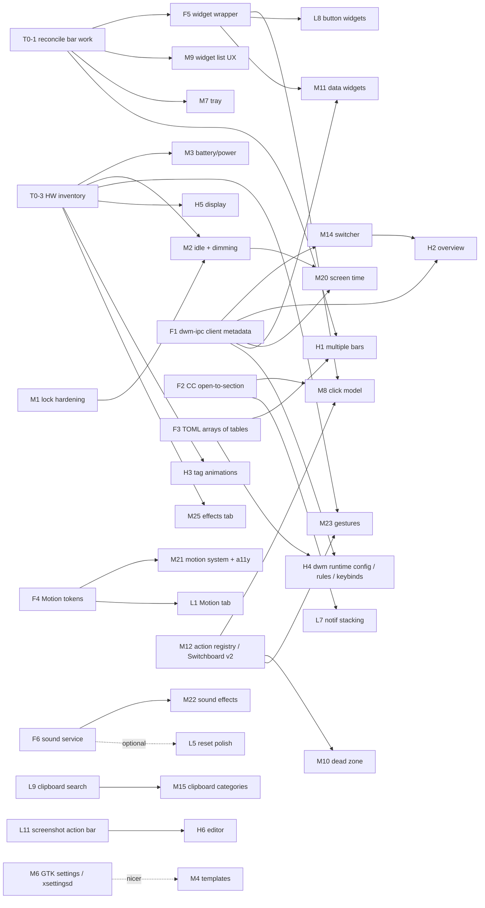

# Xidou Shell — Feature Backlog Roadmap

Working roadmap for はる and future Claude Code sessions. Planning only: nothing in this
document has been implemented as part of writing it.

- **Written:** 2026-09-27, against `master` at `32b5354` (pushed state of `omxm/xidou-shell`).
- **Source:** はる's backlog "アイデア集&改善ポイント #1 / #2" plus the ChatGPT idea list
  (items marked [却下] are excluded; items marked [微妙] are listed at the end as parked).
- **Method:** every backlog item was cross-referenced against the actual code, not
  against CLAUDE.md alone. Where the two disagree, the code wins (per CLAUDE.md's own rule).
- **Written from a cloud container with no access to the real X11 session.** Every
  item below is tagged with how much of it can be trusted without real hardware.

This is a living document. When an item ships, move it to "Done" in the status table
(section 2) and update CLAUDE.md in the same commit. When a decision in section 4 is
made, write the answer inline next to the question, so the next session doesn't re-ask.

---

## 0. Legend

**Effort tiers**

| Tier | Meaning |
|---|---|
| **Light** | One or two files, existing patterns reused, roughly one session. |
| **Moderate** | New service/singleton or a cross-cutting change across several files; one to a few sessions. |
| **Heavy** | Architecture change, new C helper or dwm patch with real design risk, or multi-session work with a migration. |

**Verification tags** (what can be trusted without はる's real machine)

| Tag | Meaning |
|---|---|
| `[CLOUD]` | Logic and layout can be built and checked under Xvfb with `$XIDOU_CONFIG_PATH` (and `$XIDOU_DWM_SOCKET` for a test dwm). Screenshots are enough evidence. |
| `[SESSION]` | Needs the real X session to judge: compositor behavior (picom), focus/grab behavior, animation feel, scroll feel, sound. Buildable in the cloud, but "done" can only be declared after はる tries it. |
| `[HW]` | Depends on X1CG5 hardware facts (battery sysfs, backlight, touchpad, TLP, GPU, external monitor). Cannot even be designed with confidence until the hardware inventory (T0-3) exists. |

**Status words:** *Done* (built and in pushed code), *Partial* (some of it exists — the
remaining delta is what's planned), *Not started*, *Claimed, unpushed* (see T0-1).

---

## 1. Read this first — findings from the cross-reference

These came out of comparing the backlog, CLAUDE.md, and the code. Several of them change
the order things should be done in.

### 1.1 CLAUDE.md describes bar work that is not in the pushed repo

The most recent commit (`32b5354`, "docs: update CLAUDE.md to reflect current project
state") adds a long description of a finished bar overhaul: General (Enabled, Auto-Hide
off/on/smart, Reserve Space), Layout, Shape (per-corner radius, Corner Flow), Effects
(opacity, shadow, contact shadow), Widgets (font/weight/spacing/colors/hover), Capsules,
in-lane up/down reordering, and per-widget sections for Volume/Bluetooth/Tray/Mem/CPU/
Power.

None of that exists in the pushed code:

- `quickshell/settings/bar/` contains only `GeneralTab.qml` (Position, Height) and
  `ModulesTab.qml`.
- `Settings.qml`'s `subTabsByCategory` lists Bar as `["General", "Modules"]` only.
- `Config.qml` has no `bar.layout`, `bar.shape`, `bar.effects`, `bar.widgets`,
  `bar.capsules`, `auto_hide`, or `reserve_space` keys.
- `Bar.qml` still paints with `color: Theme.background` directly (no inner Rectangle, no
  `MultiEffect`, no `HoverHandler`, no `capsuleModuleComponent`).
- `ModulesTab.qml`'s header comment still says reordering is "explicitly out of scope".
- `bar_widgets` in `Config.qml` only has weather/clock/workspaces/media.

It also says "Widget List and Dead Zone were already done beforehand." In the code, Dead
Zone is one hardcoded right-click → control-center handler (`Bar.qml:122`
`handleDeadZoneClick`) with no settings UI, and Widget List is on/off + move between
lanes.

**Most likely explanation:** the work exists on はる's machine and was never committed or
pushed. **Action (T0-1) before anything bar-related starts:** push that work, or, if it
was lost, correct CLAUDE.md. This roadmap does *not* re-propose those tabs — it treats
them as "Claimed, unpushed" and marks every item that builds on them.

### 1.2 The lock screen is probably not secure yet

`quickshell/session/LockScreen.qml` is a real PAM lock, but it is an ordinary
full-screen `PanelWindow`. Nothing takes an X keyboard/pointer grab (no `XGrabKeyboard`
anywhere in the repo), and dwm's own keybinds are passive grabs on the root window, so
they very likely still fire while "locked" — e.g. `super+Return` would spawn a terminal
behind the lock, and `super+q` would kill whatever client has focus. And if Quickshell
crashes or is restarted, the lock disappears and the desktop is exposed. Neither has been
tested on the real session, so this is an inference from the code, not a confirmed bug.

This matters for ordering: **idle-lock (M2) and lock-on-suspend must not be built on top
of the lock as it is today.** Hardening it (M1) comes first.

### 1.3 The `keybind` keys in config.toml don't do anything

`config.example.toml` has `keybind = "super+d"` etc. under every `[panels.*]` table, and
CLAUDE.md's philosophy says panel keybinds are config-driven. But nothing reads those
keys — dwm's `config.h` hardcodes every bind at compile time. Changing them in
config.toml silently does nothing. Either mark them as documentation-only in the example
file, or make them real (that is part of H4). Recorded as T0-2.

### 1.4 Things that turned out to be closer to done than the backlog assumes

- Color matching (matugen) and M3 scheme selection already work from **both** Settings >
  Appearance > Theme ("Palette Source", "Wallpaper Generation Scheme") and the wallpaper
  picker's preset cycler. No matugen fork is needed for anything in the backlog — see 1.5.
- The Motion *backend* already exists (`services/MotionSync.qml` + `lib/PicomSync.js`
  rewrite picom's animation block from `[motion]` and SIGUSR1 picom). Only the Settings
  tab is still a `PlaceholderTab`. That makes the Motion tab a Light item.
- The Power section in control-center already shows percentage, charging state, time to
  full/empty, battery health (when supported) and model.
- Workspaces already has hide-empty, three styles (regular / minimal / focus_hint with
  dots), and app icons.
- Screenshot already has every toggle from the backlog except "copy to clipboard" as
  its own switch (it currently always saves *and* copies).
- Session menu (`super+Escape`) with 1–5 number keys is done; slot 3 is "Reserved".
- Launcher already centers the selection with edge clamping (keyboard-driven) and shows
  real app icons. Mouse-wheel-moves-selection is the missing piece.

### 1.5 Where I disagree with the backlog's own reasoning

These are pushback, not refusals — each one has a decision entry in section 4.

1. **"Fork matugen" is unnecessary.** matugen already has a template system (per-app
   output files rendered from the palette) — that is exactly what a Templates tab needs
   — and `matugen color hex <#rrggbb>` generates an M3 scheme from a seed color, which
   covers "M3 color presets". Forking it would mean owning its color-science code forever
   for no feature gain.
2. **"GTK settings need dwm forked into XidouWM" doesn't hold.** On X11, GTK reads its
   theme/icons/cursor/font from `~/.config/gtk-3.0/settings.ini`, `gtk-4.0/settings.ini`,
   `~/.gtkrc-2.0`, and live from an XSETTINGS daemon (`xsettingsd`). The cursor theme
   is `~/.icons/default/index.theme` + `Xcursor.theme`/`Xcursor.size` in X resources +
   `xsetroot -cursor_name left_ptr` for the root window. None of that touches the window
   manager. It's a nice idea; it just doesn't depend on a WM fork.
3. **dwm is already forked.** `dwm/` is a vendored, heavily patched dwm (IPC, dwindle,
   Shape corners, dock stacking, directional focus, strut support). "Forking to XidouWM"
   is mostly a rename. What *would* be new is making dwm read settings at runtime
   instead of compile time — that's the real work, and it's H4.
4. **Forking picom is a bad trade.** picom is a large C codebase with GL backends; a
   fork means rebasing upstream fixes forever, on one person's time. Its v12 animation
   scripts are already scriptable. Try H3's cheap experiment first (1.6) before
   considering this.
5. **TLP isn't required for charge thresholds.** thinkpad_acpi exposes
   `/sys/class/power_supply/BAT0/charge_control_{start,end}_threshold` directly, and the
   repo already has the udev-rule-for-sysfs-write pattern (`90-xidou-backlight.rules`).
   *But* `PowerSection.qml` says this machine already runs TLP, and TLP rewrites
   thresholds on boot and AC changes, so two owners would fight. One of them must own
   thresholds (decision D9).
6. **"custom_button" conflicts with はる's own rule.** The backlog says free-text command
   fields are unacceptable ("テキストフィールドがあって手動でコマンド追加するのは御免"),
   but a custom button is by definition a user-supplied command. Either it's the one
   explicit exception, or it's replaced by "pick an action from the Switchboard action
   registry" (recommended — see M12).
7. **Gestures and tag switching.** A 3-finger swipe to go to the next/previous tag is
   exactly the "next/prev workspace" abstraction lesson #6 warns about. It's safe only if
   the gesture handler computes an explicit target tag number from DwmIpc state and calls
   `view` with that mask.

### 1.6 A useful correction for the animation question

`session/picom.conf`'s comment says a dwm tag switch "is a plain unmap/map". This dwm
doesn't do that: `showhide()` (`dwm/dwm.c:2195`) hides clients by `XMoveWindow` to
`-2 * width` offscreen and shows them by moving them back. Two consequences:

- A tag switch is a **geometry change**, not a map/unmap. picom v12's animation system
  has a `geometry` trigger. **It's worth one real-session experiment** to see whether a
  `geometry`-triggered animation slides windows in on tag switch before planning a dwm
  patch or a picom fork (H3). `[SESSION]`
- Windows on hidden tags stay **mapped**, so their XComposite pixmaps stay valid. Live
  thumbnails for an overview (H2) are therefore possible from a small C helper, without
  needing Quickshell's screencopy support (which I believe is Wayland-only — verify).

---

## 2. Status of every backlog item

Sorted in backlog order. "Plan ID" points into sections 3–5.

### アイデア集 #1

| # | Item (short) | Status | Plan ID |
|---|---|---|---|
| 1 | All services started from xinitrc | **Done** (convention; `ensure_running` block). New daemons below must follow it. | — |
| 2 | Wallpaper color matching + M3 scheme choice in Settings *and* wallpaper picker | **Done** (matugen, both entry points). Fork not needed (1.5). | — |
| 3 | Templates / per-app theming tab (Settings only) | Not started | M4 |
| 4 | Animations (research + "I want animations") | **Partial**: picom open/close done; Motion backend done; tab placeholder; tag switch not animated | L1, M21, H3 |
| 5 | Wallpaper directories in Settings | **Done** (Wallpaper > General) | — |
| 6 | Everything (dwm config, resolution, scale) in Settings | Not started (dwm config is compile-time) | H4, H5 |
| 7 | Overridden / Reset UI, long-press or double-click reset | **Partial**: badge + one-click reset exist (right side of row) | L5 |
| 8 | Screenshot settings | **Mostly done**; missing separate "copy to clipboard" / "save to file" toggles | L3 |
| 9 | Lock screen | **Partial**: PAM lock exists; hardening needed (1.2) | M1 |
| 10 | Settings panel separate from control-center | **Done** | — |
| 11 | Bar customization (general … dead zone) | **Claimed, unpushed** for General/Layout/Shape/Effects/Widgets/Capsules (1.1). Widget List UX and Dead Zone UI **not started**. | T0-1, M9, M10, section 6 |
| 12 | Battery widget (health, AC, profile, time, thresholds, laptop/desktop detect) | **Partial**: CC Power shows %, status, time, health; bar shows % + icon; `hasBattery` check exists | M3 |
| 13 | `super+Esc` session menu with 1–5 keys | **Done** except slot 3 | L2 |
| 14 | Idle settings with gradual dimming | Not started | M2 |
| 15 | Nicer UI icons | Not started (vague) | L13 |
| 16 | GTK settings (nwg-look) inside Settings | Not started | M6 |
| 17 | Screen Time in control-center | Placeholder only | M20 |
| 18 | System monitor in control-center | **Partial**: CPU/mem/disk exist | M13 |
| 19 | Widget overhaul | Not started (vague — decomposed) | F5, M8, M9 |
| 20 | Overview / window switcher (`super+Tab`) | Not started (dwm bind reserved; no IpcHandler listens) | M14, H2 |
| 21 | Workspaces: only occupied/focused, styles, numbers vs dots | **Done** (hide_when_empty, regular/minimal/focus_hint, icons) | — |
| 22 | Tray drawer (collapsible), open/closed default | Not started; also right-click has no menu | M7 |
| 23 | Xidou icon and logo | Not started (Logo module is a placeholder wordmark) | M24 |
| 24 | Launcher Switchboard (chip, many actions, ←→ sliders) | **Partial**: 4×3 grid mode exists, Tab cycles 3 modes | M12 |
| 25 | Fork dwm → XidouWM, own animation patch, fork picom etc. | Decision | H8 |
| 26 | Make config easier to change | Mostly = Settings panel; concrete remainder | L10 |
| 27 | Big list of bar widgets | 12 exist (logo, workspaces, media, clock, weather, tray, mem, cpu, bluetooth, volume, dnd, power); the rest are new | L8, M11, section 6 |
| 28 | Left-click → CC page, right-click → configurable action | Not started | F2, M8 |
| 29 | Choose which CC sections are shown | Not started | L6 |
| 30 | Theme export/import | Not started | M17 |
| 31 | Unlimited bars, bar export/import/duplicate | Not started | H1 |
| 32 | Stack 3+ notifications, click → CC Notifications | Not started | L7 |
| 33 | Sound effects | Not started | F6, M22 |
| 34 | Tailscale status widget | Not started | M11 |
| 35 | M3 color presets like Noctalia | Not started | M5 |
| 36 | Trackpad gestures | Not started | M23 |

### アイデア集 #2

| # | Item | Status | Plan ID |
|---|---|---|---|
| 37 | Launcher: scroll moves selection, selection stays centered except at the ends; app icons | **Partial**: centering + clamping + icons done (`28b9a8c`); wheel does nothing (`interactive: false`) | L4 |

### ChatGPT list (non-rejected)

| Item | Status | Plan ID |
|---|---|---|
| Switchboard as searchable action palette | Not started | M12 (merged) |
| Xidou Health | Not started | M16 |
| Window Rules GUI | Not started | H4 |
| Scratchpad | Not started | M18 |
| Clipboard by type + pins + actions | Not started (no search either) | L9, M15 |
| Screenshot action bar | **Partial**: Save/Cancel preview exists | L11 |
| Screenshot editing | Not started | H6 |
| Display Profiles | Not started | H5 |
| Resource History | Not started | M13 |
| Keyboard Shortcut Visualizer | Not started | M19 (view), H4 (edit) |
| First-run Setup | Not started | M24 |
| Xidou Motion System | **Partial** (picom side only) | F4, M21 |
| Management console (Undo / Presets / Safe Mode) | **Partial** (the Settings panel is the console) | H7 |
| [微妙] Device Center | Parked — see section 8 | — |

### Still-open items from CLAUDE.md (not in the backlog, kept for completeness)

| Item | Plan ID |
|---|---|
| Appearance > Accessibility / Motion / Effects placeholders | L1 (Motion), M21 (Accessibility), M25 (Effects) |
| Per-widget panel for Logo and DND | L12 |
| Startup / splash screen | M24 |
| X1CG5 hardware inventory | T0-3 |

---

## 3. Tier 0 — housekeeping and foundations

Small things that unblock or de-risk everything else. Do these first.

### T0-1 Reconcile CLAUDE.md with the pushed code — Light `[HW]` (needs はる's machine)
- **What:** find out whether the bar overhaul in 1.1 exists locally. If yes, commit and
  push it. If no, rewrite the Bar bullet in CLAUDE.md to match the code.
- **Blocks:** M8, M9, M10, M7 (Tray per-widget section), H1, and anything touching
  `Bar.qml`. Building any of those on the pushed `Bar.qml` would create a merge
  conflict with the unpushed work.

### T0-2 Make `[panels.*].keybind` honest — Light `[CLOUD]`
- **What:** mark them in `config.example.toml` and `Config.qml` as "documentation only,
  dwm's config.h is the real source" until H4 makes them real. Also fix the CLAUDE.md
  philosophy line saying keybinds are config-driven.
- **Alternative:** delete the keys. Decision D1.

### T0-3 X1CG5 hardware inventory — Light `[HW]`
- **What:** on the real machine, record in CLAUDE.md: CPU/GPU (`lspci`, `glxinfo -B`),
  panel resolution/DPI (`xrandr`), battery (`ls /sys/class/power_supply/BAT*/` —
  check `charge_control_*_threshold`), backlight device, touchpad name and whether it is
  a Synaptics/Elan clickpad, TLP version (`tlp-stat -s`), whether `power-profiles-daemon`
  or TLP's own profile support is available on Artix, audio card.
- **Also:** `session/picom.conf` still picks `xrender` because of "this 2012 Intel iGPU"
  (X230). On X1CG5 (Kaby Lake HD 620) `glx` is likely fine and required for blur and
  better animations. Re-evaluate there.
- **Blocks:** M3, M2 (dim path), M23, H5, M25, H3.

### F1 dwm-ipc: expose per-client metadata — Light/Moderate `[CLOUD]`
- **What:** add `class`, `instance`, `pid`, and on-screen geometry to `get_dwm_client`
  (`dwm/yajl_dumps.c`), and a "client list" query (all clients with tags + monitor).
  Today `Workspaces.qml` shells out to `xdotool getwindowclassname` once per focus
  change because IPC lacks WM_CLASS.
- **Unblocks:** window switcher (M14), overview (H2), Screen Time (M20), active_window
  and taskbar widgets (M11, section 6), Window Rules "add rule from focused window" (H4),
  and removes the xdotool dependency.
- **Verify:** testable with a test dwm on `$XIDOU_DWM_SOCKET` under Xvfb.

### F2 Open control-center at a given section — Light `[CLOUD]`
- **What:** `PanelManager` only has `toggle(name)`. Add an `open(name, section)` path and
  an IPC call such as `xidou msg control-center open Audio`. ControlCenter selects that
  section on open instead of resetting to Home.
- **Unblocks:** widget click model (M8), notification stack click (L7), Switchboard
  actions like "Audio output…" (M12).

### F3 TOML: arrays of tables (and probably inline tables) — Moderate `[CLOUD]`
- **What:** `lib/Toml.js` explicitly does not support `[[...]]`. Needed for: multiple
  bars (`[[bars]]`), window rules, and any list of structured things (custom actions,
  template entries). `Toml.setValue` must also *write* them without destroying
  comments.
- **Risk:** the writer is the delicate part — it edits text in place. Needs unit-style
  tests (a small `node` test script against fixture files works in the cloud).
- **Unblocks:** H1, H4, M4 (if templates are listed in config).

### F4 `Motion.qml` token singleton — Light `[CLOUD]` for code, `[SESSION]` for feel
- **What:** the QML-side equivalent of `Theme.qml` for motion: named durations and
  easing (`Motion.fast/normal/slow`, `Motion.enter/exit/emphasized`), all derived from
  `[motion]`, with a global "reduce motion" multiplier. Replace hardcoded durations
  (e.g. Launcher's `duration: 120` + `OutCubic`) with tokens.
- **Why before M21:** same reasoning as "never hardcode a color" — otherwise the
  Motion System ends up being a search-and-replace later.

### F5 Common bar widget wrapper — Moderate `[CLOUD]`
- **What:** one wrapper every bar module sits in, owning: left/right/middle click
  dispatch, scroll dispatch, hover highlight, tooltip, and capsule background. The
  unpushed `capsuleModuleComponent` (1.1) may already be most of this — build on it
  after T0-1, don't duplicate it.
- **Unblocks:** M8 (click model), L8/M11 (new widgets reuse it for free).
- **Depends on:** T0-1.

### F6 Sound service — Light `[SESSION]`
- **What:** a `SoundFx` singleton with `play(eventName)`, global enable, volume, and
  "mute while DND". Backend choice: Qt Multimedia `SoundEffect` if the installed
  Quickshell/Qt has it, otherwise `pw-play` (PipeWire, already a dependency).
- **Unblocks:** M22, the reset-confirmation sound in L5.

### F7 dwm runtime settings channel — Heavy — see H4.

---

## 4. Decisions needed from はる

Grouped by what they block. Each has a recommendation, but these are genuinely yours to
make. Write the answer next to the question when decided.

| ID | Question | Options | Recommendation | Blocks |
|---|---|---|---|---|
| D1 | `[panels.*].keybind`: remove, document as decorative, or make real? | remove / document / real (H4) | Document now, make real later with H4 | T0-2 |
| D2 | Overridden/Reset position: left of the control (backlog) or right (today)? | left / right | Left, as specified — but it shifts every control horizontally when it appears. Reserve the space always so layout doesn't jump. | L5 |
| D3 | Reset gesture: long-press, double-click, or both? With sound? | long-press / double-click / both | Long-press with a fill animation (it's discoverable and hard to trigger by accident); double-click as a secondary path. Sound only once F6 exists. | L5 |
| D4 | Session menu slot 3 | Reload shell / Suspend / Reload config / Lock+Suspend | **Suspend.** It's the action a laptop needs most, and "Reload shell" can live in Switchboard. If you prefer Reload, say which (restart Quickshell vs re-read config). | L2 |
| D5 | Switchboard: keep the grid, or make it a searchable command list? What does Tab do now that Emoji mode exists? | grid / searchable list / both | Both: empty query shows the grid, typing filters a list of all actions. Keep Tab cycling App → Switchboard → Emoji, and show the mode chip ("\|Switchboard\|") left of the input. Your spec said Tab toggles back to Launcher — that conflicts with Emoji mode's existence; decide. | M12 |
| D6 | Widget click model: left-click → CC section for *every* widget that has one? | as backlog / per-widget default | As backlog, but configurable per widget in the gear panel (left/right/middle/scroll each pick from an action list). | M8 |
| D7 | `custom_button`: allow a raw command field as the one exception, or only pick from the action registry? | raw command / registry only | Registry only, plus an "Advanced: shell command" field hidden behind an Advanced toggle. | M11 |
| D8 | Templates: name and placement | "Templates" / "Theming" / "App Theming"; own category vs Appearance sub-tab | Call it **Templates** (same word as matugen and Noctalia, so docs line up) as a sub-tab of Appearance. Which apps first? Suggest kitty, GTK 3/4, Qt (qt6ct), Firefox (if you use pywalfox), dmenu/rofi if present. | M4 |
| D9 | Who owns battery charge thresholds: TLP or Xidou? | TLP config / direct sysfs / remove TLP | Let TLP own them and have Xidou edit TLP's config (or call `tlp setcharge`) — least conflict with what's already installed. Revisit after T0-3. | M3 |
| D10 | Idle stages and defaults | e.g. dim at 4 min, lock at 5, screen off at 6, suspend at 15 on battery | Separate AC/battery profiles; dim is a gradual fade over ~5–10 s, any input cancels it. Also: should media playback (MPRIS playing) block idle? (Recommend yes.) | M2 |
| D11 | Screen Time definition | per-app focused time / total active time / both; retention | Per-app focused time (from dwm focus + idle), daily totals, 30-day retention, stored locally only. | M20 |
| D12 | "Nicer icons" — what's wrong with the current ones? | Rounded style / filled for active states / different weight / different font | Stay on Material Symbols (one maintained font), but use the FILL axis for active/on states and possibly the Rounded variant. Needs your eye. | L13 |
| D13 | M3 presets: seed colors or full hand-made palettes? | seeds via matugen / named palettes (Catppuccin etc.) / both | Both: a row of seed colors (matugen does the rest) plus a few hand-made palettes, all selectable from Appearance > Theme. | M5 |
| D14 | Sound: where do the sound files come from? | freedesktop sound theme / self-made / licensed pack | Start with the freedesktop sound theme (license-clean) and let each event point to a file. | M22 |
| D15 | CC "Monitor" vs "System": your CC list has both | split / merge | Split: **Monitor** = live numbers + history; **System** = static system info (CPU model, kernel, uptime, packages). | M13 |
| D16 | Overview: full GNOME-style overview, or a window switcher first? | switcher first / overview first | Switcher first (M14), overview later (H2) — the switcher is most of the daily value at a fraction of the risk. | M14, H2 |
| D17 | Screenshot editor: build in QML or delegate to an existing X11 editor? | build / delegate (e.g. satty, flameshot's editor) | Delegate first behind an "Edit" button, build only if the delegated editor feels out of place. | H6 |
| D18 | Startup splash and first-run setup: one thing or two? | merge / separate | Merge: the splash's "Start" button leads into first-run setup the first time, and just dismisses afterwards. | M24 |
| D19 | XidouWM: rename the vendored dwm? Fork picom? | rename / keep "dwm" name; fork picom yes/no | Renaming is cheap and fine if you want the identity. Don't fork picom (1.5). | H8 |
| D20 | Appearance > Effects: what goes in it? | global blur / shadows / panel transparency / all | Decide after T0-3 (glx vs xrender). Probably: panel background opacity, global shadow, blur behind panels (needs glx). | M25 |
| D21 | Multiple bars: what differs per bar? | everything / subset | Position, monitor, modules, and the Layout/Shape/Effects/Widgets/Capsules tables; theme stays global. | H1 |
| D22 | Gestures: which gestures → which actions? | — | 3-finger swipe L/R → adjacent tag *by explicit number*; 3-finger up → switcher/overview; 3-finger down → close panels; 4-finger → your choice. | M23 |
| D23 | Health auto-fix: what may it do without asking? | restart user daemons only / anything | Only restart user-level daemons it itself started (pipewire family, picom, xidou-clipd). Never touch system services. | M16 |

---

## 5. The plan, by effort tier

Each entry: **what**, **current state / files**, **depends on**, **decisions**,
**verification**.

### 5.1 Light

**L1 — Appearance > Motion tab**
- What: real tab over `[motion]` (enabled, duration, preset). The backend
  (`MotionSync.qml`, `PicomSync.js`) already exists, and `picom.conf` already refers to
  this tab by name.
- Depends on: nothing. Nicer after F4 (the same tab can then drive QML motion too).
- Verify: `[CLOUD]` for the tab and the picom.conf rewrite; `[SESSION]` for the look.

**L2 — Session menu slot 3**
- What: fill `Session.qml` item 3 and the SessionActions function behind it.
- Decisions: D4. Verify: `[CLOUD]` for UI; `[HW]` if Suspend (lock-before-suspend
  depends on M1).

**L3 — Screenshot: separate "Save to file" and "Copy to clipboard" toggles**
- What: `Screenshot.qml` always does `mkdir -p && maim … && xclip …`. Split into two
  config keys (`save_to_file`, `copy_to_clipboard`, both default true); at least one must
  stay on (grey out the other's Off when it would leave neither).
- Verify: `[CLOUD]` (Xvfb + maim + xclip all work headless).

**L4 — Launcher: wheel moves the selection**
- What: keep the existing clamped-centering `contentY` binding, add a `WheelHandler` that
  changes `selectedIndex` instead of scrolling. Touchpads send many small `pixelDelta`
  events — accumulate until one row's worth before stepping, or two-finger scroll will
  race.
- Verify: `[CLOUD]` for mouse wheel logic; `[SESSION]` for how the X1CG5 touchpad
  feels (must be tuned there).

**L5 — Overridden/Reset polish**
- What: move the badge per D2, long-press/double-click per D3, fill animation during
  the long press. Check that ModulesTab's `customReset` rows get the same behavior.
- Depends on: F6 only if a sound is wanted.
- Verify: `[CLOUD]`.

**L6 — Choose which control-center sections are shown**
- What: `[panels.control_center].sections = [...]` (order = display order), a Settings
  page with toggles + up/down reorder. ControlCenter.qml's `sections` becomes
  config-driven. Home is always on.
- Settings placement: there is no control-center category in Settings yet — this would
  be the first real tab for one (fine under the "backed by a real feature" rule).
- Verify: `[CLOUD]`.

**L7 — Notification stacking**
- What: when more than N (default 3) popups are active, collapse them into one "N
  notifications" card; clicking it opens CC > Notifications. N is configurable.
- Depends on: F2. Verify: `[CLOUD]` (`notify-send` works under Xvfb with a dbus session).

**L8 — Simple action-button widgets**
- What: launcher, settings, session, screenshot, wallpaper, control-center, caffeine,
  nightlight, theme_mode, notifications (with unread badge), spacer, text. Each is an
  icon (and optional label) whose click calls something that already exists.
- Depends on: F5 (so they get click dispatch/hover/capsules for free), T0-1.
- Verify: `[CLOUD]`.

**L9 — Clipboard search**
- What: a filter field in `Clipboard.qml` (text entries only). First step before M15.
- Verify: `[CLOUD]`.

**L10 — "Make config easier to change" — concrete remainder**
- Surface config parse errors visibly (today a TOML typo silently falls back to all
  defaults with only a console warning — a notification saying "config.toml line 42:
  …, using defaults" would save real confusion).
- `xidou config reload` / `xidou config path` CLI helpers in `bin/xidou`.
- Keep `config.example.toml` in sync — a small check script that diffs its keys against
  `Config.qml`'s defaults would catch drift (it has already drifted: `bar_widgets` is in
  `Config.qml` but not in the example file).
- Verify: `[CLOUD]`.

**L11 — Screenshot action bar**
- What: extend `ScreenshotConfirm.qml` from Save/Cancel to Copy / Save / Open (in image
  viewer) / Edit (→ H6 or delegated editor) / Delete.
- Verify: `[CLOUD]`.

**L12 — Per-widget panel for Logo and DND**
- What: the two modules without a real Widget section (per CLAUDE.md; verify after
  T0-1). Logo: which image/wordmark, click action. DND: show when off or only when on.
- Depends on: T0-1. Verify: `[CLOUD]`.

**L13 — Icon polish**
- What: per D12. Material Symbols' FILL axis (0→1) for on/active states is a
  `font.variableAxes` change, not a new font.
- Verify: `[SESSION]` (it's purely a matter of taste).

### 5.2 Moderate

**M1 — Lock screen hardening (high priority)**
- What:
  1. Take an active keyboard + pointer grab while locked (a small C helper in `bin/`
     like `xidou-focus-window`, or an X11 call if Quickshell exposes one), so dwm's
     root binds and other clients see nothing.
  2. Decide the crash behavior: if Quickshell dies while locked, the session must not
     end up unlocked. Options: a tiny separate locker process that owns the grab and is
     only told "unlock" by the shell after PAM succeeds; or have xinitrc start the
     locker, not the shell.
  3. Lock on suspend / lid close: listen to elogind's `PrepareForSleep`, or run
     `xss-lock` pointing at `xidou msg session lock`.
  4. Disable VT switching while locked is *not* possible from an X client without root
     — document it rather than pretend.
- Why first: M2 (auto-lock on idle) would make an insecure lock look trustworthy.
- Verify: grab logic `[CLOUD]` (Xvfb + xdotool key injection can prove dwm binds no
  longer fire); `[SESSION]` + `[HW]` for suspend/lid.

**M2 — Idle management with gradual dimming**
- What: an idle daemon (recommend a small C helper, `xidou-idled`, using the
  XScreenSaver extension's idle time — same pattern as `xidou-focus-window`) that runs
  staged timers: dim (fade backlight over several seconds via `bin/xidou-brightness`,
  restore on input) → lock (M1) → screen off (DPMS) → suspend. Settings > System >
  Idle with separate AC/battery values.
- Must respect: Caffeine (today it holds an `elogind-inhibit` lock, which an X idle
  daemon won't see on its own — check the inhibitor list or Caffeine's state directly),
  fullscreen video, and optionally MPRIS playback.
- Alternative to writing C: `xidlehook` (supports multiple timers and "not when
  fullscreen/audio"). Fine too — decide when implementing.
- Depends on: M1, T0-3. Decisions: D10.
- Verify: timer logic `[CLOUD]`; dimming and DPMS `[HW]`.

**M3 — Battery / power widget overhaul**
- What: bar widget shows AC-connected state; click → CC Power (via M8). CC Power gains:
  AC status, charge threshold slider (e.g. 60–100 % end threshold), power profile,
  battery-saver toggle. Laptop vs desktop: already half there (`hasBattery` /
  `isLaptopBattery`) — hide the widget and the section on desktops.
- Power profile backend: this machine uses TLP (per `PowerSection.qml`), so
  Quickshell's PowerProfiles API (power-profiles-daemon) would sit inert. Check what the
  installed TLP version offers for profile switching (newer TLP releases added
  profile commands — verify against the installed version's docs, not memory).
- Depends on: T0-3, D9. Verify: `[HW]` for all of it.

**M4 — Templates (per-app theming)**
- What: Settings > Appearance > Templates: a list of apps, each with an on/off switch;
  on = matugen renders that app's template when the palette regenerates; plus a "apply
  now" button. Ship templates in the repo (`templates/kitty.conf`, `gtk.css`, …) and
  generate matugen's config from the enabled list. Reload hooks per app (kitty: `kill
  -SIGUSR1`, GTK: via xsettingsd from M6).
- Depends on: nothing hard; M6 makes GTK reload clean. Decisions: D8.
- Verify: generation `[CLOUD]`; app reload behavior `[SESSION]`.

**M5 — M3 color presets**
- What: in Appearance > Theme: a row of preset seeds + named palettes (D13). Seed →
  `matugen color hex … --source-color-index 0` (lesson #2 — keep the flag even though
  it's not strictly about images) → same JSON pipeline `ColorScheme.qml` already reads.
  Adds `theme.source = "preset"` alongside builtin/wallpaper.
- Verify: `[CLOUD]` (matugen runs headless with the flag).

**M6 — GTK / icon / cursor / font settings (nwg-look inside Settings)**
- What: new Settings category (e.g. "Applications" or under Appearance): GTK theme,
  icon theme, cursor theme + size, font, dark preference. Writes gtk-3.0/gtk-4.0
  `settings.ini`, `~/.gtkrc-2.0`, `~/.icons/default/index.theme`, Xresources
  `Xcursor.*`, and xsettingsd's config; starts `xsettingsd` from the xinitrc
  `ensure_running` block so running GTK apps change live. Qt apps: qt6ct config.
- Lists of themes come from scanning `/usr/share/themes`, `~/.themes`, `/usr/share/icons`,
  `~/.local/share/icons`.
- Depends on: nothing (see 1.5 #2). Verify: file writing `[CLOUD]`; live GTK update
  `[SESSION]`.

**M7 — Tray drawer and menus**
- What: (a) Right-click on a tray item currently calls `secondaryActivate()`; apps like
  mozc and blueman expect a context menu. Use the item's menu (`hasMenu` / `menu`) with
  Quickshell's menu opener. (b) A collapsible drawer: pinned items shown, the rest behind
  a chevron; per-item "pinned/hidden" in the Tray gear panel; drawer default open/closed.
- Depends on: T0-1 (CLAUDE.md claims a Tray per-widget section exists unpushed).
- Verify: `[SESSION]` (tray items and menus need real apps; menus as popups on X11 are
  exactly the kind of thing that behaves differently under Xvfb).

**M8 — Widget click model**
- What: every widget gets left/right/middle/scroll slots. Default per D6: left → its CC
  section, right → its quick action (e.g. Volume: right = mute, which is today's left).
  Each slot picks from an action registry (shared with Switchboard, M12).
- Depends on: F2, F5, T0-1. Verify: `[CLOUD]`.

**M9 — Widget List UX (the backlog's "widget list" tab)**
- What: Start / Center / End sub-tabs; each lists its modules in order with drag handle,
  checkbox (multi-select delete), and gear. "+" at the top right of each tab opens an
  add-picker sorted by previously-added / frequency (reuse `UsageStats.qml`, as the
  backlog suggests).
- Drag-and-drop: QML `DragHandler` + `DropArea` in a `ListView`; keep the up/down buttons
  (claimed unpushed) as the keyboard path.
- Depends on: T0-1. Verify: `[CLOUD]` for logic; drag feel `[SESSION]`.

**M10 — Dead Zone tab**
- What: Bar > Dead Zone: left / right / middle click and scroll up/down on empty bar
  space each pick an action from the registry ("not set", toggle settings, toggle CC,
  launcher, next/prev tag *by explicit number*, …). `handleDeadZoneClick()` was already
  isolated for this.
- Depends on: M12's action registry (or a small one defined here first and moved there
  later). Verify: `[CLOUD]`.

**M11 — Data widgets**
- network (Wi-Fi/ethernet state, SSID), brightness (with scroll), keyboard_layout
  (`setxkbmap -query` / XKB), lock_keys (Caps/Num via XKB state), active_window (needs
  F1), privacy (mic/camera in use: PipeWire nodes with active streams), power_profile
  (after M3), tailscale (`tailscale status --json`; tailscaled is a system service,
  which on Artix means a runit service — not the xinitrc block), sysmon (combined
  CPU/mem/temp).
- Depends on: F5; F1 for active_window. Decisions: D7 for custom_button.
- Verify: mostly `[CLOUD]`; tailscale needs an account `[HW]`; privacy needs real mic
  `[SESSION]`.

**M12 — Switchboard v2 (searchable action palette)**
- What: an **action registry** (`services/Actions.qml`): id, label, icon, keywords,
  `run()`, optional `value`/`adjust(delta)` for sliders. Everything in the backlog list
  goes in: DND, Wi-Fi, Bluetooth, brightness and volume (←/→ adjust), mic mute, audio
  output/input switching, Night Light, dark/light, battery saver and power profile
  (after M3), VPN/Tailscale, wallpaper, display settings (after H5), screenshot, lock,
  reload Xidou, reload config, restart PipeWire.
- UI per D5: "|Switchboard|" chip left of the input, grid when empty, filtered list
  while typing.
- The same registry feeds M8 (widget click slots), M10 (dead zone), D7 (custom button),
  and gestures (M23) — build it once.
- Verify: `[CLOUD]`.

**M13 — Monitor section + resource history**
- What: per D15. Monitor: CPU (per-core), memory, network throughput (from
  `/proc/net/dev`), disk, temperatures (`/sys/class/hwmon`), GPU if meaningful (X1CG5
  has Intel graphics only; `intel_gpu_top` needs root — probably skip GPU and say so),
  each with a sparkline of the last N minutes. One sampling service shared by the bar's
  cpu/mem widgets and this section (today `Cpu.qml` and `SystemSection.qml` each parse
  `/proc/stat` separately). System: CPU model, kernel, uptime, distro, packages, shell
  version.
- Verify: logic `[CLOUD]`; real values `[HW]`.

**M14 — Window switcher (`super+Tab`)**
- What: a panel listing windows (icon + title + tag), most-recently-focused order,
  Tab/Shift+Tab to move, release to focus. dwm already binds `super+Tab` to `xidou msg
  windowswitcher toggle`; nothing listens yet.
- Needs: F1 (client list + class for icons) and an MRU order — either track focus events
  in the shell (DwmIpc already subscribes to focus changes) or add it to dwm. Focusing a
  window on another tag = `view` that tag by explicit mask, then focus the client.
- "Release super to confirm" needs key-release detection of the modifier, which is
  awkward on X11 when the panel doesn't own the grab; the simple alternative is
  Enter-to-confirm. Decide in implementation.
- Verify: `[CLOUD]` with a test dwm; `[SESSION]` for key-release behavior.

**M15 — Clipboard categories, pins, actions**
- What: tabs All / Text / Images / URLs / Code / Pinned (classification by simple
  heuristics); pinned entries survive `xidou-clipd`'s 50-entry pruning (daemon change:
  a separate pinned list it never prunes); actions per type (open URL, open path in file
  manager, copy as plain text).
- Depends on: L9. Verify: `[CLOUD]`.

**M16 — Xidou Health**
- What: a diagnostics page (Settings > System > Health, or a CC section): dwm-ipc socket
  reachable, Quickshell version, PipeWire/WirePlumber/pipewire-pulse alive *and* on the
  current D-Bus session (reuse xinitrc's stale-daemon check), picom running with the
  expected config, xidou-clipd alive, NetworkManager/bluez reachable, notification
  server owned by Xidou, config parse status (L10), matugen present. "Fix" buttons per
  D23.
- This directly serves the philosophy in CLAUDE.md ("if one piece breaks, you can't tell
  which piece broke") — worth more than its ChatGPT origin suggests. Recommend doing it
  early-ish.
- Verify: `[CLOUD]` for checks; fixes `[SESSION]`.

**M17 — Theme export / import**
- What: export `[theme]` (+ the bar look tables once T0-1 lands) to a standalone
  `.toml`; import merges it via `Config.setValue` chains (remember the
  `cachedText`/chaining lesson in `Config.qml`). A file picker needs an X11-friendly
  approach (Quickshell has no native file dialog on this setup — a simple in-shell
  directory browser or a fixed `~/.config/xidou/themes/` folder with a list).
- Verify: `[CLOUD]`.

**M18 — Scratchpad**
- What: dwm "named scratchpads" patch (a hidden tag per scratchpad, toggled by key),
  e.g. `super+grave` → kitty with a known class. Patch into the vendored dwm.
- Depends on: F1 is helpful for the class match. Verify: `[CLOUD]` with a test dwm;
  `[SESSION]` for feel.

**M19 — Keyboard shortcut viewer (read-only)**
- What: a Settings page listing every bind with a human label. Source of truth: generate
  a JSON from `dwm/config.h`'s `keys[]` at build time (a small script run by
  `dwm/Makefile`), or add an IPC command that dumps the table. Editing is H4.
- Verify: `[CLOUD]`.

**M20 — Screen Time**
- What: per D11. A logger (in the shell, via DwmIpc focus events + class from F1, with
  idle time from M2's helper subtracted) writing daily totals to
  `~/.local/share/xidou/screentime/`. CC section with today's per-app bars and a 7-day
  view.
- Depends on: F1, M2 (for idle), D11. Verify: `[CLOUD]` with synthetic focus events.

**M21 — Motion System + Accessibility tab**
- What: move every panel to F4 tokens; define shared transitions (open/close/expand/
  collapse/switch/hover/success/error). Accessibility tab: reduce motion (multiplier →
  0 disables), larger text, high-contrast toggle.
- Depends on: F4. Verify: `[SESSION]`.

**M22 — Sound effects**
- What: events per the list in section 7; each maps to a file with per-event on/off in
  Settings > Sound (a new category, allowed since it's backed). USB detection needs a
  `udevadm monitor --udev --subsystem-match=usb` listener process.
- Depends on: F6, D14. Verify: `[SESSION]`.

**M23 — Trackpad gestures**
- What: `touchegg` (supports X11) or `libinput-gestures` (needs the user in the `input`
  group), started from the xinitrc block, with actions calling `xidou msg …` from the
  action registry. Per D22 and 1.5 #7 (explicit tag numbers only).
- Depends on: T0-3, M12. Verify: `[HW]`.

**M24 — Logo, splash, first-run setup**
- Logo/icon: human design work; Claude can produce SVG drafts, but whether it's right is
  your call. Keep the "orbit" concept from the name; don't reference serpantinum
  (CLAUDE.md rule).
- Splash + first-run per D18: a full-screen panel shown on session start when
  `[startup].enabled`; first run walks through Theme, Wallpaper, Bar position, Keyboard
  layout, Power/Idle, Notifications — each step reuses existing Settings tabs rather than
  duplicating controls. "Skip" always available; a flag in
  `~/.local/state/xidou/` records completion.
- Depends on: most Settings tabs existing (so it's naturally late), logo for the splash.
- Verify: `[CLOUD]` for flow; `[SESSION]` for the finished look.

**M25 — Appearance > Effects tab**
- What: per D20. Probably picom-level (shadows, blur behind panels — needs `glx`) plus
  panel-level opacity. The bar's own Effects tab (unpushed) is a precedent for the QML
  side.
- Depends on: T0-3, D20. Verify: `[SESSION]` (and note CLAUDE.md's warning that picom
  GLX + `layer.effect` can render blank under Xvfb).

### 5.3 Heavy

**H1 — Multiple bars, duplicate, export/import**
- What: config moves from `[bar]` to `[[bars]]` (with a one-time migration that keeps an
  existing `[bar]` working), each bar with its own id, monitor, position, modules, and
  look tables. `shell.qml` instantiates one `Bar` per entry. Settings > Bar gets a bar
  picker (+ Add, Duplicate, Delete, Export, Import). Two bars on the same edge must
  stack struts correctly — the strut logic lives in dwm (`37c9415`), so check it handles
  multiple dock windows on one edge.
- Depends on: F3, T0-1, D21. Verify: logic `[CLOUD]`; strut stacking `[SESSION]`.

**H2 — Overview (GNOME-style)**
- What: full-screen panel showing every tag as a group of window thumbnails; click to
  go there; later drag between tags. Thumbnails: a C helper using XComposite
  (`XCompositeNameWindowPixmap`) to dump PNGs of each client — possible because this dwm
  keeps hidden clients mapped offscreen (1.6). Refresh on open, not continuously.
- Depends on: F1, M14 (reuse its model), D16. Verify: `[SESSION]` (compositor
  interaction with picom must be checked on the real GPU).

**H3 — Tag-switch and window-move animations**
- Step 1 (cheap): real-session experiment with a picom `geometry` trigger (1.6). If it
  animates tag switches acceptably, add it to the MotionSync-managed block and stop here.
- Step 2 (only if step 1 fails): animate in dwm itself — interpolate `XMoveWindow` over
  a few frames on tag switch and on arrange. Known risks: flicker without compositor
  sync, and every intermediate position triggers client redraws. Likely needs to be
  opt-in.
- Step 3 (not recommended): picom fork (1.5 #4).
- Depends on: T0-3 (backend), D19. Verify: `[SESSION]` only.

**H4 — dwm runtime settings: gaps/borders/layout params, window rules, keybinds**
- What: dwm reads everything from `config.h` at compile time. To edit from Settings:
  (a) numeric settings (border width, corner radius, gaps, mfact, nmaster) via new IPC
  setters + a startup read of `~/.config/xidou/dwm.toml` (or the main config);
  (b) window rules from a runtime list instead of `rules[]`; (c) keybinds from a runtime
  table — the largest part, since dwm grabs keys by keysym at startup and on mapping
  changes. Also unify the three independent corner radii (dwm `cornerradius`, picom
  `corner-radius`, `[theme].radius`) that the comments already flag as unshared.
- Window Rules GUI: list + "add rule from focused window" (class from F1).
- Depends on: F1, F3, D1, D19. Verify: `[CLOUD]` with a test dwm for most of it.

**H5 — Display settings and Display Profiles**
- What: Settings > Display: resolution, refresh rate, position, primary, scale. Scaling
  on X11 is not one knob: `Xft.dpi` (most toolkits, needs app restart), `QT_SCALE_FACTOR`
  / `GDK_SCALE` (session restart), or `xrandr --scale` (blurry). Be honest in the UI
  about which require a relogin. Profiles: save/restore layouts, auto-switch on hotplug
  (`autorandr` is the proven backend on X11).
- Depends on: T0-3. Verify: `[HW]` — needs an external monitor to test at all.

**H6 — Screenshot editor**
- What: per D17. If built: a QML canvas over the captured image — crop, pen, arrow,
  rectangle, blur/pixelate region, highlight — with export via ImageMagick (lesson #3:
  always write real PNGs through ImageMagick).
- Depends on: L11. Verify: `[CLOUD]` for export; `[SESSION]` for drawing feel.

**H7 — Management-console extras: Undo, Presets, Safe Mode**
- Undo: keep the last N `cachedText` snapshots of config.toml; Settings header gets an
  Undo button. Cheap once written — could be Moderate.
- Presets: = M17 + H1's bar export, surfaced together.
- Safe Mode: if Quickshell crashes K times within M seconds (xinitrc wrapper loop),
  restart it with `$XIDOU_CONFIG_PATH` pointed at an empty file (all defaults) and show
  a notification. Needs the xinitrc to supervise Quickshell instead of a single
  background `&`.
- Verify: `[CLOUD]` for Undo; Safe Mode `[SESSION]`.

**H8 — XidouWM identity / forks**
- Per D19 and 1.5. Rename is Light (binary name, desktop file, IPC socket default path,
  docs). A picom fork is not planned.

---

## 6. Additional bar ideas (you asked for more)

Not scheduled yet — pick what you like and it becomes an item.

- **Conditional visibility per widget:** media only while something plays, bluetooth
  only when powered on, battery only on battery power, tray only when non-empty.
- **Scroll actions per widget:** volume/brightness by wheel, workspaces by wheel (as
  explicit tag numbers), media seek.
- **Hover tooltips** with detail (e.g. CPU widget → top 3 processes; weather → today's
  range).
- **Urgent-tag highlight** on Workspaces — dwm-ipc already exports `urgent` in
  `tag_state`, so this is almost free.
- **Fullscreen behavior:** hide the bar, or make it opaque, while the focused client is
  fullscreen (`is_fullscreen` is already in IPC).
- **Per-monitor module lists** (becomes natural with H1).
- **Badges:** unread notification count on a control-center/notifications button.
- **Separator widget** with style (line / dot / gap).
- **Bar profiles** switchable from Switchboard ("Focus" = minimal bar, "Full").
- **Middle-click slot** on every widget (e.g. middle-click on volume = switch output
  device).
- **Widget entrance animation** when a conditionally visible widget appears (uses F4).

## 7. Sound effect ideas (for M22)

Default-on candidates: notification arrival (different for critical urgency), battery
low / critical, charger plugged / unplugged, screenshot shutter, lock and unlock (plus a
soft "denied" on a wrong password), USB device connected / removed, Bluetooth device
connected, wallpaper change (the paper-slide you described), volume change tick
(rate-limited so holding the key doesn't machine-gun).

Default-off candidates: launcher open, app launched, tag switch, panel open/close,
Settings reset (long-press completion), startup chime.

All of them: muted during DND, one global volume, one global off switch.

---

## 8. Parked

- **[微妙] Device Center** — mostly overlaps CC Audio/Bluetooth/Network and H5's Display
  settings. Revisit after those exist; if anything is missing then, it's probably just
  a "USB devices" list.
- **Community wallpapers tab** — stub in `Wallpaper.qml` ("no online source decided
  yet"); not in the backlog, left alone.

---

## 9. Dependency map

---

## 10. Suggested order

Priority is: safety first, then foundations that many items share, then things used
every day, then looks, then big bets. Within a milestone, order is flexible.

**Milestone 0 — housekeeping (next session, needs はる at the machine for T0-1/T0-3)**
T0-1, T0-2, T0-3.

**Milestone A — safety and foundations**
M1 (lock hardening), F1, F2, F4, M16 (Health — cheap, and it's the philosophy).

**Milestone B — the bar, finished properly**
F5, M12's action registry (the list, before its UI), M8, M9, M10, M7, L8, L12, M3.

**Milestone C — daily comfort**
L4, L2, L3, L7, M2, M12 (Switchboard UI), L9, L11, L6, L5, M14.

**Milestone D — look and feel**
L1, M21, M5, M4, M6, L13, F6 + M22, M25, M13.

**Milestone E — window management**
M18, M19, M20, M15, H2.

**Milestone F — big bets**
F3 + H1, H4, H5, H3, H6, H7, M24 (splash / first-run / logo — naturally last, as
CLAUDE.md already planned), H8.

---

## 11. Notes for whoever implements an item

- Re-read CLAUDE.md and the auto-memory file first; re-check this document's status
  table against `git log` — it will drift.
- Test under Xvfb with `$XIDOU_CONFIG_PATH` (and `$XIDOU_DWM_SOCKET` for a test dwm).
  Never touch the real config from a test run.
- Any new daemon goes in `session/xidou-xinitrc`'s `ensure_running` block; system-level
  services (tailscaled, TLP) do not — they are runit services.
- Every matugen call keeps `--source-color-index 0`.
- Material Symbols codepoints come from fontTools, never typed by hand.
- Items tagged `[SESSION]`/`[HW]` are not "done" until はる has tried them on the X1CG5.
  A cloud session should say so in its commit message and in CLAUDE.md rather than
  claim completion.
